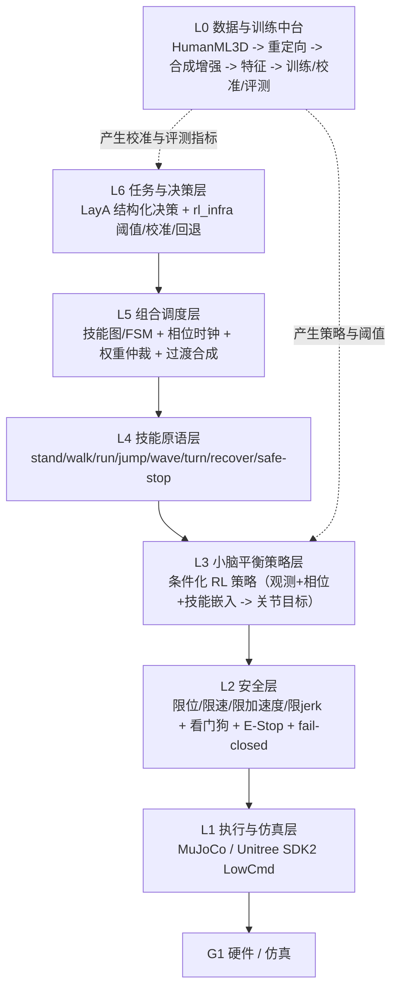

# Unitree G1 小脑平衡 + 多动作自适应组合系统 —— 完整实现提示词

> 版本：v1.0（2026-10-04）
> 来源任务：本目录 `总目标.md`（Jev-like 决策层 / rl_infra / vLLM 三层原型）
> 扩展目标：在 G1 上实现「小脑平衡底座 + 多动作可组合（跑跳 / 挥手 / 转弯）+ 自主切换与降级」
> 适用对象：可直接执行本提示词的 AI 智能体（Codex / Agent / LLM）与人类工程师
> 本文档地位：本文件 + `总目标.md` 共同构成实现任务书；两者冲突时，**控制/安全以本文件为准，
> 决策层接口以 `总目标.md` 为准**，并把冲突记入 `.agent/decisions.md`。

---

## 0. 如何使用本提示词

1. **一次性执行**：把本文件整体作为任务书交给智能体。执行者必须逐节产出，禁止「只给方案不落盘」。
2. **先勘察后设计**：第 2 节的资产清单是 2026-10-04 实测结果。执行者仍需在动工前重跑第 2.5 节的勘察命令，
   版本、关节数、DOF 数、真机可用性以复测为准。
3. **执行顺序（强制）**：

```text
Step 1  勘察现状（目录 / 环境 / 模型 / 数据 / 动作工程）
Step 2  建 TASK.md 与 .agent/，复述交付物与验收标准
Step 3  数据合成与特征工程（第 4、5 节）
Step 4  小脑平衡策略训练（第 6 节）
Step 5  技能原语与组合调度（第 7 节）
Step 6  LayA 决策层 + rl_infra 评测（第 8 节）
Step 7  服务化（第 9 节）
Step 8  安全门禁与真机预留（第 10 节）
Step 9  逐文件实现（第 11 节）→ 测试 → 验收门禁（第 12 节）
Step 10 交叉一致性检查 + 记忆沉淀（`.agent/`）
```

4. **报告纪律**：任何「更快 / 更稳 / 不劣化 / 可适应」的结论必须给出命令、数据、随机种子与基线对比。
5. **不确定时的默认动作**：按工程上最保守的方案继续推进（降低幅度 / 降低速度 / 回退到稳定态），
   把不确定项记入 `.agent/failures.md`，不要停下任务等待提问。

---

## 1. 角色、最高优先级与任务边界

### 1.1 角色

你是资深机器人系统工程师 + RL Infra 工程师 + 决策模型工程师，同时具备：

- 人形机器人全身控制（WBC）、MPC、零力矩点（ZMP）/ 捕获点（CP）与步态相位基础；
- MuJoCo / IsaacLab 仿真、域随机化、Sim-to-Real；
- Unitree G1 硬件接口（SDK2 / unitree_hg / LowCmd / LowState / DDS）与安全状态机；
- 强化学习训练工程（PPO、AMP、教师-学生蒸馏、课程学习、并行环境）；
- 运动数据工程（HumanML3D / AMASS 动捕表示、重定向、数据增强）；
- 结构化决策模型工程（校准概率、阈值路由、人工升级、离线评测）。

### 1.2 最高优先级（从高到低，任何取舍按此排序）

```text
人员安全 > 设备安全 > 平衡稳定 > 动作可组合性 > 动作幅度与速度 > 开发速度
```

当「动作更好看」与「平衡更稳」冲突时选平衡；当「跳到更高」与「落地可控」冲突时选可控落地；
当「真机表现」与「仿真未验证能力」冲突时，禁止进入真机。

### 1.3 任务边界（与 `总目标.md` 完全一致，不得越界）

**必须做**：

- 把「跑跳 / 挥手 / 转弯」等动作抽象成可配置的 **skill primitive set**，不写死在逻辑里；
- 小脑平衡策略输出 **关节目标 / 位置增量**（经 PD 或阻抗执行），经安全层后才到执行器；
- LayA 只输出结构化决策（primitive / confidence / risk / need_human_review / fallback_action），
  不输出自然语言，不进入硬实时回路；
- 数据合成、特征工程、训练、评测、回放、日志全部可复现。

**禁止做**：

- 不把 LayA 设计成聊天模型，不把大模型放进 50–1000 Hz 控制环；
- 不让决策层直接输出电机力矩 / 电流，不绕过 `SafetyWrapper`；
- 不在无仿真验证、无安全检查的情况下设计真机动作执行；
- 不编造硬件结论：无真机时只允许标注「编译级 / 启动级 / 接口级 / 未验证」。

### 1.4 完成定义（DoD）

1. 第 11 节目录树中每个文件真实存在、可导入、可运行，无 TODO / TBD / 空实现；
2. 核心模块有类型标注与 docstring；`pytest` 全绿；仿真场景全部达到第 12 节通过标准；
3. 训练、评测、demo、服务、验收各有可重跑命令，产物落盘（JSON / CSV / Markdown）；
4. 同一份配置驱动仿真与真机（dry-run），差异只存在于适配层与 `configs/real.yaml`；
5. 任意安全异常可在日志中定位到时间、状态、关节、数值、阈值、原因与回退动作；
6. 交付「修改文件 / 新增文件 / 每个模块作用 / 运行方法 / 缺口 / 真机接入路径」六项报告。

---

## 2. 已核验资产清单（先读后写）

### 2.1 决策模型：LayA

路径：`/home/violet/Workspace/Model/laya`

| 文件 / 子目录                                 | 事实（实测）                                                                                                                                               | 在本系统中的用途                   |
| ---------------------------------------- | ---------------------------------------------------------------------------------------------------------------------------------------------------- | -------------------------- |
| `model/convaiinnovations/laya/README.md` | LayA = 多语言、非自回归 System-1 决策模型；输入 state(文本/JSON) + typed questions，输出 typed answers；单次前向约 33 ms；不生成文本                                                 | 决策层模型卡与使用约束                |
| 根 checkpoint（`model.safetensors` 842 MB） | ModernBERT-large，421M，512 ctx，英文 / guardrails / 邮件分诊                                                                                                 | 英文状态文本决策（可选）               |
| `multilingual/`（643 MB）                  | mmBERT-base，322M，1024 ctx（可到 8192）                                                                                                                   | 中文/多语言状态文本决策（默认）           |
| `typed-decisions/`（842 MB）               | ModernBERT-large，1024 ctx；其官方基准 4 工作流 2000 决策准确率 0.766                                                                                               | 结构化决策主力 checkpoint（优先微调起点） |
| `rl_agent_config.json`                   | `temperature` 3 头（1.637 / 1.251 / 1.983）、`temperature_by_options` 分桶（choice:2/3-5/6-10/11+、score、noul）、`act_costs.escalate=0.5`、`cost_wrong_act=3.0` | 校准与升级策略的直接依据               |
| `rl_agent_api.py`                        | `RLAgent.system_one(state, questions) -> typed answers`，Jev 兼容请求/响应形状                                                                                | 决策层适配器实现参考                 |
| `rl_common.py`                           | 模型构建、`render_options`、`confidence_from_probs`、温度分桶                                                                                                   | 校准/置信度实现参考                 |
| `eval/results.json`、`eval/results.md`    | 官方评测结果与可靠性曲线数据                                                                                                                                       | 基线对照与回归门槛                  |

**关键约束**：LayA 输入是文本 / JSON，不是张量观测。机器人数值状态必须先经过
「特征工程 → 文本化状态（第 5.6 节）」才能进入 LayA；LayA 的输出必须再映射回
「动作原语 + 风险 + 是否人工接管」，不能直接映射成关节角。

### 2.2 动作工程：`Action/`

| 路径                     | 事实（实测）                                                                                                                                                                                                                                           | 复用方式                       |
| ---------------------- | ------------------------------------------------------------------------------------------------------------------------------------------------------------------------------------------------------------------------------------------------ | -------------------------- |
| `Action/G1_Walk`       | 行走 ONNX（0.6 m/s）+ MuJoCo Warp 训练栈（`src/rl/g1_grpo`，GRPO/PPO + 六阶段课程 + 诊断 + 验收门禁）；`start.sh` 提供 walk/train/eval/verify/test                                                                                                                       | 复用其训练/评估/验收脚本形态与 ONNX 部署路径 |
| `Action/G1_run`        | 跑步 ONNX + `deploy/g1_deploy/config/g1_amp.yaml`：`control_dt=0.02`、`sim_dt=0.005`、`control_decimation=4`、`history_length=4`、2.0 m/s 指令、策略关节序含腰/臂；`start.sh metrics/verify` 输出指标 JSON                                                              | 跑步原语基线 + 控制频率事实标准          |
| `Action/G1_Waving`     | 单臂挥手状态机 + `common/trajectory.py` + `common/wave_motion.py` + `common/safety.py` + 三级安全（WARN/ABORT/EMERGENCY）+ 看门狗 0.2/0.2/0.05 s + `BalanceController` 协议（PASS_THROUGH / LOW_LEVEL_SIM_ONLY）+ `real/` SDK2 arm_sdk 适配；84 项测试通过                   | 挥手原语 + 安全层 + 平衡补偿接口的直接接入点  |
| `Action/legged_rl_lab` | IsaacLab 2.3 + rsl_rl；G1 velocity flat/rough 任务；G1 AMP 任务（`amp_env.py`、`amp_ppo.py`、`amp_on_policy_runner.py`）；G1 parkour depth；跨本体混合；GMR 重定向（`smplx_to_robot.py`、`bvh_to_robot.py`、`assets/unitree_g1/g1_mocap_29dof.xml`）；`metamorphosis` 动作管线 | 小脑策略训练主栈 + 动作重定向管线         |

### 2.3 运动数据集：`/home/violet/Workspace/Data/Embodied_AI/Unitree_G1`

| 数据集              | 结构（实测）                                                                                                                                                                                                    | 用途 / 注意                         |
| ---------------- | --------------------------------------------------------------------------------------------------------------------------------------------------------------------------------------------------------- | ------------------------------- |
| `HumanML3D_272d` | 21 GB；`motion_data/*.npy`（272 维、30 FPS，样例 `(175, 272)`）；`texts/*.txt`（动作描述 + 词性标注 + 起止时间）；`split/{train,val,test}.txt` = 23384 / 1337 / 4041 条；`mean_std/{Mean,Std}.npy` 各 272 维；`motion_data.zip` 8.4 GB | 主训练数据源（动作先验 / 重定向源 / 文本-动作配对）   |
| `HumanML3D`      | 197 MB；SMPL 原始 `HumanML3D/new_joint_vecs`、`new_joints`、`texts.zip`、`index.csv`（14616 行，列 `source_path,start_frame,end_frame,new_name`）、`common/`（四元数、骨架）、`paramUtil.py`                                   | 重建 / 可视化 / 重定向校验；与 272d 为同源不同表示 |
| `KIT-ML`         | 1.2 GB；`new_joint_vecs.rar`、`new_joints.rar`、`texts.rar`、train/val/test 划分、`Mean.npy`/`Std.npy`                                                                                                           | 跨数据集泛化验证（需解压）                   |
| `AMASS`          | 空目录（0 文件）                                                                                                                                                                                                 | 缺失项：需要时由用户另行提供，不得假装存在           |

### 2.4 数据增强参考：`data_enhance/`

| 论文                 | 实际主题（实测）                                                   | 方法论迁移方式                              | 领域 gap（必须写进文档）        |
| ------------------ | ---------------------------------------------------------- | ------------------------------------ | --------------------- |
| `1901.02970v2.pdf` | NOCS：类别级 6D 位姿与尺寸估计；提出 context-aware 混合现实数据生成（合成物体 + 真实场景） | 迁移「合成-真实混合数据 + 上下文一致性」到动作数据          | 该文是物体位姿领域，不直接研究人形动作增强 |
| `1912.11913v2.pdf` | ANCSH：铰接物体类别级位姿；规范空间层级 + 关节参数分解，实现类内泛化                     | 迁移「规范动作空间 + 结构分解（整体 / 四肢 / 相位）」到动作表示 | 同上，属于物体位姿领域           |

执行者必须把这一 gap 明确写入 `docs/design/data_synthesis.md`，禁止声称两篇论文直接支持动作增强。

### 2.5 环境与入口（实测）

```text
conda env      unitree_rt（当前激活）
Python         3.12.9
PyTorch        2.14.0+cu130，CUDA True
MuJoCo         3.13.0
官方仿真窗口   /home/violet/Workspace/Code/Embedded_code/unitree_workspace/scripts/mujoco_sim.py
```

动工前必须复跑的勘察命令：

```bash
python -c "import sys, torch, mujoco; print(sys.version.split()[0], torch.__version__, torch.cuda.is_available(), mujoco.__version__)"
find /home/violet/Workspace/Model/laya -maxdepth 3 -name '*.safetensors' -o -maxdepth 3 -name 'rl_agent_config.json'
python - <<'PY'
import numpy as np, glob
p = sorted(glob.glob('/home/violet/Workspace/Data/Embodied_AI/Unitree_G1/HumanML3D_272d/motion_data/*.npy'))[0]
print(p, np.load(p).shape)
PY
ls /home/violet/Workspace/Code/Project/Embodied_AI/Unitree/Action
```

### 2.6 技术偏差与已登记决策（不得静默修改）

1. **vLLM 偏差**：`总目标.md` 要求 vLLM 服务化；但 vLLM 主要服务自回归 LLM 的生成式推理，
   LayA 是编码器分类模型。本系统保留统一服务接口（`cb_serving/`），默认实现用
   `laya[serve]` / ONNX Runtime / FastAPI；只有当后续接入生成式动作模型（如扩散/自回归动作生成器）时，
   才启用 vLLM 适配器。该偏差必须写入 `docs/design/serving.md` 与 `.agent/decisions.md`。
2. **data_enhance 领域偏差**：见 2.4，只做方法论迁移。
3. **AMASS 缺失**：KIT-ML 需解压，AMASS 为空；所有数据脚本必须在数据集缺失时给出明确报错，
   不允许静默跳过导致「统计口径不一致」。

---

## 3. 系统总体架构

### 3.1 一句话目标

在 G1 上实现一个**以小脑平衡策略为底座、以技能原语为积木、以 LayA 结构化决策为路由**的
低层行为系统：机器人可以自主选择并组合「站立 / 行走 / 跑步 / 跳跃 / 挥手 / 转弯 / 恢复 /
降级保护 / 请求人工接管」，在动作切换与外力扰动下保持平衡，并能在失败时安全回退。

### 3.2 分层架构（每层单一职责，跨层只走接口）



### 3.3 端到端数据流

```mermaid
graph LR
    A[HumanML3D_272d 272维@30FPS] --> B[GMR/SMPL-X 重定向到 G1 29DOF]
    B --> C[规范化 + 镜像/幅度/速度/相位增强 + 过渡片段合成]
    C --> D[物理可行性过滤 + 质量报告 + manifest]
    D --> E[特征工程: 本体感知/平衡量/相位/指令/历史]
    E --> F[IsaacLab + rsl_rl PPO/AMP 训练小脑策略]
    F --> G[ONNX 导出 + MuJoCo Sim2Sim 验证]
    G --> H[技能原语库 + 组合调度器]
    H --> I[LayA 决策: primitive/risk/fallback/need_human_review]
    I --> J[安全层 + watchdog + E-Stop]
    J --> K[G1 真机 dry-run -> 分级放行]
    K --> L[运行数据回流 -> rl_infra 评测/校准/再训练]
    L --> C
```



### 3.4 时序边界（硬性）

| 回路      | 频率                                    | 责任                         | 说明                               |
| ------- | ------------------------------------- | -------------------------- | -------------------------------- |
| 物理仿真步   | 200 Hz（`sim_dt=0.005`）                | MuJoCo / IsaacLab          | 与现有 `g1_amp.yaml` 一致             |
| 小脑控制回路  | 50 Hz（`control_dt=0.02`，decimation=4） | 平衡策略 + 安全层                 | 与现有部署栈一致                         |
| 安全监控    | ≥ 50 Hz，事件驱动触发                        | `SafetyWrapper` / watchdog | 状态 0.2 s、命令 0.2 s、控制回路 0.05 s    |
| 组合调度    | 10–50 Hz                              | 技能图 / 相位时钟                 | 切换必须落在相位窗口                       |
| LayA 决策 | 1–20 Hz（单前向约 33 ms）                   | 决策层                        | 只给出原语与风险，不进入硬实时                  |
| 人工接管    | 事件驱动                                  | 升级策略                       | `need_human_review` 或安全 veto 时触发 |

---

## 4. 数据合成与增强（从数据开始）

### 4.1 统一数据表示（单一事实来源）

所有数据脚本、训练脚本、评测脚本只允许消费下列 5 个结构化对象；字段一旦确定，写入
`src/cb_data/schema.py` 并冻结版本号。

```text
MotionClip          # 原始动捕片段（人类骨架空间）
  clip_id: str              # 唯一 ID，如 "humanml3d:000001:0-175"
  source: str               # humanml3d_272d | humanml3d_smpl | kit_ml
  fps: float                # 30.0
  frames: int
  root_pos:  (T,3)          # 米，Z-up
  root_quat: (T,4)          # wxyz
  joint_pos: (T,J)          # 弧度
  joint_vel: (T,J)          # 可选，缺失时由差分估计
  contacts:  (T,C)          # 布尔足端接触（估计或标注）
  text: str                 # 动作描述（HumanML3D texts）
  license: str              # 数据许可（学术用途等）

RetargetedClip      # 重定向到 G1 的片段
  retarget_id: str
  robot: "unitree_g1_23dof" | "unitree_g1_29dof"
  joint_names: list[str]    # 顺序即策略关节序（与部署一致）
  qpos/qvel/tau: (T,J)
  keypoint_pos: (T,K,3)     # 用于重定向残差校验
  retarget_err: (T,)        # 每帧 IK 误差
  source_clip: str

SkillSegment        # 单一技能切片（训练与组合的基本单位）
  segment_id: str
  skill: str                # stand|walk|run|jump|wave|turn|recover|safe_stop
  t_start/t_end: float
  phase: (T,)               # [0,1) 归一化相位
  command: dict             # 该片段的目标指令（速度/转向/跳高/挥手臂侧）
  quality: dict             # 重定向误差/动力学可行性/接触一致性得分

TransitionSegment   # 技能间过渡（组合能力的关键数据）
  transition_id: str
  from_skill/to_skill: str
  blend_window: float       # 默认 0.3–0.6 s
  phase_alignment: str      # 相位对齐规则（如左脚触地时刻）

DatasetManifest     # 数据集版本与溯源
  dataset_version: str
  files: {path, sha256, frames, fps}
  stats: {mean, std, count_by_skill, count_by_source}
  splits: {train, val, test}
  aug_profile: str          # 增强配置 hash
  created_at / tool_version
```

### 4.2 数据管线（固定 8 步，缺一不可）

```text
S1  ingest       读 272d / SMPL / KIT-ML，产出 MotionClip + 文本
S2  canonicalize 规范化：根相对坐标 + 朝向坐标系 + 时间重采样 + 相位参数化
S3  retarget     GMR/SMPL-X → G1（23/29 DOF），产出 RetargetedClip + IK 误差
S4  segment      语义切片：按文本/运动学切分为 SkillSegment（站/走/跑/跳/挥/转）
S5  augment      镜像 / 幅度 / 速度 / 相位 / 根轨迹 / 噪声 / 延迟 / 过渡合成
S6  physics      物理可行性过滤（限位/速度/加速度/jerk/接触/支撑域）
S7  split        按源序列切分 train/val/test，禁止同源泄漏
S8  manifest     统计 + 哈希 + 版本 + 可视化抽检，产出 DatasetManifest
```

每步对应一个纯函数或一个脚本（见第 11 节文件职责），并配套 `tests/` 用例：
同一输入必须产出逐比特一致的输出（固定 seed、固定版本），浮点比较用 `np.allclose(rtol=1e-6)`。

### 4.3 重定向（HumanML3D → G1）

主路径（复用已有工程，不新造轮子）：

```bash
# 参考入口（legged_rl_lab/GMR），以实际脚本参数为准
python /home/violet/Workspace/Code/Project/Embodied_AI/Unitree/Action/legged_rl_lab/GMR/scripts/smplx_to_robot.py \
    --robot unitree_g1 \
    --motion <path/to/motion.npz> \
    --save_path <path/to/out.pkl>
python /home/violet/Workspace/Code/Project/Embodied_AI/Unitree/Action/legged_rl_lab/GMR/scripts/bvh_to_robot.py \
    --robot unitree_g1 --bvh_file <file.bvh> --save_path <out.pkl>
```

要求：

1. 机器人资产统一使用 `GMR/assets/unitree_g1/g1_mocap_29dof.xml`（含手版本 `g1_mocap_29dof_with_hands.xml`）；
2. 关节顺序以**部署栈策略序**为唯一事实来源（G1_run 的策略关节序含腰与手臂），必须在
   `src/cb_data/joint_map.py` 中生成映射表并用测试锁定；
3. 23 DOF 与 29 DOF 的选择写进 `configs/system.yaml`，不允许代码里出现裸数字；
4. 每段重定向必须记录 IK 误差、关节限位触碰次数、脚部滑动量，超阈值片段进入 rejected 列表，
   不允许静默丢弃。

### 4.4 规范动作空间（ANCSH 方法论迁移）

把 ANCSH 的「对象规范空间 + 部件规范空间」类比为：

```text
运动规范空间 = 根轨迹（世界/朝向）+ 相位时钟（周期）+ 关节幅度（尺度）+ 结构分解（四肢/躯干）
```

具体规则（写入 `src/cb_data/canonicalize.py`，参数进 `configs/data.yaml`）：

1. 根轨迹：世界系位移拆成「朝向坐标系内位移 + 朝向角」，朝向坐标系按起始朝向对齐；
2. 时间：重采样到固定 FPS（30）并做周期归一化，周期性动作（走/跑）按触地时刻对齐相位零点；
3. 幅度：按肢体段长归一化关节角与末端轨迹，保留每段 `scale` 元数据用于还原；
4. 结构：拆成 `root / left_leg / right_leg / torso / left_arm / right_arm / head` 七组，
   组合调度时按组分配控制权（例如挥手只作用右臂组 + 平衡补偿作用于下肢组）。

### 4.5 数据增强清单（全部参数化、可开关、可复现）

| 增强      | 参数（默认值）                                       | 目的            | 风险控制                |
| ------- | --------------------------------------------- | ------------- | ------------------- |
| 左右镜像    | `mirror: true`                                | 扩增单侧动作（挥手/转弯） | 同步取反 yaw/roll 与接触标签 |
| 时间缩放    | `tempo: 0.85–1.15`                            | 适应不同执行速度      | 缩放后必须过速度/加速度过滤      |
| 幅度缩放    | `amplitude: 0.9–1.1`                          | 适应不同动作幅度      | 上限由关节限位余量决定         |
| 相位抖动    | `phase_jitter: ±0.05 周期`                      | 抗相位偏差         | 用于训练、不用于验收基线        |
| 根轨迹扰动   | `root_xy_noise: 0.01–0.03 m`、`yaw_noise: ±2°` | 抗初始状态偏差       | 与地形/外力随机化联动         |
| 观测噪声/延迟 | `obs_noise: 高斯`、`obs_delay: 0–2 控制步`          | Sim-to-Real   | 评价必须用固定 seed 对照组    |
| 动力学随机化  | 质量/摩擦/PD 增益/执行器带宽/外力                          | 域随机化          | 采样范围写入 profile hash |
| 过渡合成    | `blend_window: 0.3–0.6 s`                     | 生成技能间过渡段      | 过渡必须满足接触一致性         |
| 组合合成    | run+jump、turn+wave、run+wave                   | 多动作结合训练       | 组合段必须有独立测试集         |

过渡合成的最低要求（`src/cb_data/synthesize.py`）：

1. 相位对齐：优先在支撑相/触地窗口切换；
2. 混合方式：根轨迹线性混合 + 关节角最小 jerk 混合 + 接触状态离散仲裁（不允许两脚同时滑动）；
3. 混合后重新做一次物理可行性过滤，并保留 `from/to/blend_window` 溯源字段。

混合现实数据（NOCS 方法论迁移，`src/cb_data/synthesize_scenes.py`）：

```text
合成侧：MuJoCo/IsaacLab 中批量回放重定向动作，随机化地形、摩擦、负载、外力、传感器噪声
真实侧：真机（未来）或高保真回放采集的小批量数据，用于校准仿真参数与评测泛化
原则：合成数据负责覆盖，真实数据负责校准；两侧数据必须使用同一 schema 与同一特征管线
```

### 4.6 物理可行性过滤（S6，硬门禁）

每帧、每关节检查以下条件，任一不过则整段降级为 `rejected` 或按规则修复：

```text
关节位置 q   ∈ [q_min + margin, q_max - margin]
关节速度 dq  ≤ k * dq_max        （默认 k=1.0）
关节加速度   ≤ a_max             （默认由部署配置推导）
jerk         ≤ j_max             （与 G1_Waving 命令调节器同源）
足端接触     滑动量 ≤ 阈值；穿透 ≤ 1e-3 m
支撑域       静态近似：CoM 投影在支撑多边形内（动态动作允许短时越界，但需标注）
根高度       站立/行走/跑步段不得低于安全下限
```

过滤报告（拒绝率、拒绝原因分布、修复数量）写入 `runs/data_quality/<version>/report.md`。

### 4.7 切分、泄漏与版本

1. 以 `HumanML3D_272d/split/*.txt` 为切分基准，并**按源序列聚簇**：同一 `source_path` 派生的所有
   切片必须落在同一 split（防止同源泄漏）；
2. 组合动作（run+jump / turn+wave / run+wave）单独建立测试集，禁止只测单动作；
3. `DatasetManifest` 记录文件 sha256、统计量、增强 profile、工具版本；训练脚本必须校验 manifest 版本，
   版本不匹配直接报错；
4. 训练/评测报告必须附带 `dataset_version`，否则视为无效结论。

### 4.8 本阶段交付物与验收

- `docs/design/data_synthesis.md`（含领域 gap 声明与增强参数表）
- `src/cb_data/*`（8 步管线）、`scripts/data_build.py`、`scripts/data_quality.py`
- `runs/data_quality/<version>/{manifest.json, report.md, stats.csv}`
- 验收：`python scripts/data_build.py --config configs/data.yaml` 退出码 0；抽检 5 段动作可视化；
  拒绝率、IK 误差、接触一致性指标写入报告；固定 seed 重跑结果一致。

---

## 5. 特征工程（训练与部署共用同一份定义）

### 5.1 观测特征分组（默认 23/29 DOF 两套，维度按实机复测）

| 组                 | 维度（29 DOF 示例） | 内容                                       | 来源       |
| ----------------- | ------------- | ---------------------------------------- | -------- |
| base_ang_vel      | 3             | 基座角速度（机体系）                               | IMU / 仿真 |
| projected_gravity | 3             | 重力方向投影                                   | IMU 姿态   |
| base_lin_vel      | 3             | 基座线速度（可用状态估计替代）                          | 状态估计     |
| command           | 5             | `vx, vy, yaw_rate, jump_flag, wave_side` | 组合调度器    |
| joint_pos         | 29            | 关节位置（相对默认姿态）                             | 编码器      |
| joint_vel         | 29            | 关节速度                                     | 编码器差分    |
| last_action       | 29            | 上一控制步动作                                  | 策略内部     |
| contact           | 2             | 左右足接触                                    | 接触估计     |
| phase_clock       | 4             | 步态相位 sin/cos + 技能相位 sin/cos              | 相位时钟     |
| skill_embedding   | 8–16          | 技能 token 嵌入                              | 组合调度器    |
| balance_feats     | 8             | CoM 位置/速度、CP 近似、支撑域余量、姿态误差               | 运动学计算    |
| history           | 4 帧           | 上述关键组的历史堆叠                               | 环形缓冲     |

写入 `src/cb_features/obs_spec.py`：每组的名称、维度、单位、归一化方式、缺失值策略。
训练与部署必须读取同一份 spec（哈希一致才允许加载 ONNX 策略）。

### 5.2 平衡专用特征（小脑的「前庭与小脑」类比）

```text
姿态误差        roll/pitch 相对目标姿态的误差（rad）
CoM 状态        CoM 位置（相对支撑中心）、CoM 速度
捕获点 CP        CP = CoM_xy + CoM_vel_xy / sqrt(g / h)   （h=质心高度）
ZMP 近似        由关节力矩/加速度近似（仿真可得真值，真机用估计）
支撑域余量      支撑多边形到 CoM/CP 投影的最短距离（站立双支撑/单支撑分别计算）
接触置信度      接触持续时间、切换频率、滑动指标
平衡裕度综合分  上述量的加权标量（权重进 configs，训练日志记录）
```

### 5.3 相位与技能特征

1. 步态相位：由接触序列估计步态周期与相位（Hilbert/极值法或接触上升沿），输出 `sin/cos`；
2. 技能相位：每个 `SkillSegment` 的归一化进度 `[0,1)`，与步态相位解耦；
3. 跳跃相位：`approach → takeoff → flight → landing → recover` 五段独热/进度；
4. 转弯特征：目标 yaw 率、yaw 误差、内外侧腿（支撑相）标记。

### 5.4 指令与技能编码

```yaml
# configs/skills.yaml（节选）
skills:
  - {name: stand,    id: 0, priority: 10, interruptible: true}
  - {name: walk,     id: 1, priority: 20, interruptible: true}
  - {name: run,      id: 2, priority: 30, interruptible: true}
  - {name: jump,     id: 3, priority: 60, interruptible: false}
  - {name: wave,     id: 4, priority: 40, interruptible: true}
  - {name: turn,     id: 5, priority: 30, interruptible: true}
  - {name: recover,  id: 6, priority: 80, interruptible: false}
  - {name: safe_stop,id: 7, priority: 100, interruptible: false}
```

优先级只能由配置修改；代码中禁止出现魔法数字。技能 token 同时提供 one-hot（调试可解释）
与嵌入（训练更省参数），由 `configs/system.yaml` 开关。

### 5.5 归一化、历史与一致性

1. 数据集统计：`HumanML3D_272d/mean_std/{Mean,Std}.npy` 用于动作侧；策略观测使用训练期
   running mean/std（随 checkpoint 保存）；
2. 裁剪：归一化后统一裁剪到 `[-5, 5]`，裁剪命中率进日志（过高说明分布漂移）；
3. 历史窗口：`history_length=4`（与 `g1_amp.yaml` 对齐），窗口不足时用重复填充并打标记；
4. 一致性契约：`feature_version` + `obs_spec_hash` 写入 checkpoint 与 ONNX metadata，
   部署端校验失败必须拒绝加载（fail-closed）。

### 5.6 LayA 文本化状态（决策层特征工程，关键环节）

LayA 只接受文本 / JSON。机器人状态必须序列化为**紧凑、稳定、可解析**的 JSON，示例：

```json
{
  "state_version": "1.0",
  "robot": "unitree_g1_29dof",
  "task": "run_then_wave_and_turn",
  "balance": {"roll_deg": 2.1, "pitch_deg": -1.4, "com_margin_m": 0.06, "cp_margin_m": 0.03,
              "contact": ["left"], "stability": "marginal"},
  "motion": {"vx": 2.1, "vy": 0.0, "yaw_rate": 0.4, "skill": "run", "phase": 0.62,
             "time_in_skill_s": 1.8},
  "context": {"terrain": "flat", "external_push": false, "latency_ms": 12, "battery_ok": true},
  "history": {"falls_last_60s": 0, "watchdog_trips_last_60s": 0},
  "candidates": ["continue_run", "run_jump", "wave_while_run", "turn_left", "recover", "safe_stop"]
}
```

对应的 questions（对齐 `总目标.md` 的四个决策头）：

```json
{
  "motion_primitive_head": {
    "type": "choice",
    "instructions": "Given the robot state and candidates, which primitive should the cerebellum execute next?",
    "criteria": {"continue_run": "...", "run_jump": "...", "wave_while_run": "...",
                 "turn_left": "...", "recover": "...", "safe_stop": "..."}
  },
  "safety_veto_head": {
    "type": "noul",
    "instructions": "Does the current state require immediate safety veto of the proposed primitive?"
  },
  "recovery_head": {
    "type": "choice",
    "instructions": "If balance is degrading, which recovery action is appropriate?",
    "criteria": {"none": "...", "small_step": "...", "stand_recover": "...", "safe_stop": "..."}
  },
  "escalation_head": {
    "type": "noul",
    "instructions": "Should human review / takeover be requested now?"
  }
}
```

要求：

1. 文本化模板放 `src/cb_features/text_state.py`，字段顺序稳定（JSON 键有序），数值按固定精度
   格式化（避免同一状态产生不同字符串）；
2. 候选动作集合由组合调度器注入，不允许模型自由生成动作名；
3. 离线评测必须固定模板版本：模板变更 → 视为新特征版本 → 重新校准与回归测试；
4. LayA 输出映射到 `DecisionOutput`（第 8 节），映射函数必须单测（含非法值兜底）。

### 5.7 本阶段交付物与验收

- `src/cb_features/{obs_spec,proprio,balance_feats,phase_clock,text_state,normalizer}.py`
- `tests/test_features_*.py`（形状、单位、归一化、历史、文本模板快照）
- 验收：同一段 RetargetedClip 经特征管线输入策略与输入 LayA 模板，均能稳定复现；
  `pytest -k features` 全绿；特征哈希写入 manifest 与 checkpoint。

---

## 6. 小脑平衡策略（训练）

### 6.1 方案选择（必须先给出 3 种方案对比，再按推荐实施）

| 方案        | 结构                                     | 优点                 | 缺点               | 结论           |
| --------- | -------------------------------------- | ------------------ | ---------------- | ------------ |
| A 统一条件化策略 | 单一策略，观测含 command + 技能嵌入 + 相位           | 动作间共享平衡能力；切换平滑；参数少 | 训练难度高，需课程与技能平衡采样 | **推荐主方案**    |
| B 每技能独立策略 | stand/walk/run/jump/wave 各一个策略 + 组合层残差 | 单技能易训；复用现成 ONNX    | 切换需要额外过渡策略；组合爆炸  | 作为过渡阶段与教师    |
| C 教师-学生蒸馏 | 用 A/B 或现有 G1_Walk/G1_run 策略作教师，蒸馏到统一学生 | 训练稳定；可继承已有成果       | 教师偏差会被继承         | **推荐与 A 组合** |

实施顺序：先 B（复用 `G1_run` / `G1_Walk` / `G1_Waving` 现有资产）建立基线 →
再 C（蒸馏）→ 最后 A（统一条件化策略）作为长期形态。每一阶段都要保留可回归的基线指标。

### 6.2 训练栈（复用现有工程，不新造框架）

| 用途                    | 主栈                                                                                         | 入口（示例）                                                                                                           |
| --------------------- | ------------------------------------------------------------------------------------------ | ---------------------------------------------------------------------------------------------------------------- |
| 大规模并行 RL / 域随机化 / AMP | IsaacLab 2.3 + rsl_rl（`Action/legged_rl_lab`）                                              | `python scripts/rsl_rl/train.py --task=LeggedRLLab-Isaac-Velocity-Flat-Unitree-G1-v0 --num_envs 4096 --headless` |
| MuJoCo Warp 快速迭代      | `Action/G1_Walk/src/rl/g1_grpo`（GRPO/PPO + 六阶段课程）                                          | `python scripts/rl_train.py --config configs/rl/g1_walk_ppo.yaml --seed 1`                                       |
| AMP 动作先验              | `legged_rl_lab` 的 `tasks/locomotion/amp`（已有 `amp_env.py`、`amp_ppo.py`、`rsl_rl_amp_cfg.py`） | 以重定向后的 `SkillSegment` 作为 AMP 参考动作                                                                                |
| 部署导出                  | ONNX（对齐 `G1_run/exported_policy/g1_run.onnx` 形态）                                           | `python scripts/export_onnx.py --checkpoint <ckpt> --out runs/<id>/policy.onnx`                                  |

训练配置必须包含：`seed`、`num_envs`、`dataset_version`、`aug_profile`、`feature_version`、
`reward_config_hash`，缺一视为不可复现实验。

### 6.3 观测、动作与奖励

1. 观测：第 5.1 节 spec（训练/部署同源）；
2. 动作：默认 **关节位置目标增量**（相对默认姿态），经 PD 执行；动作限幅 + 安全包装；
   跳跃等特殊技能允许叠加腿长/推力模式，但必须在 `configs/skills.yaml` 中显式声明；
3. 奖励（每项单独可消融，`src/cb_train/rewards.py`）：

```text
跟踪项     : 速度跟踪、yaw 跟踪、跳跃高度/距离跟踪、技能进度跟踪
平衡项     : 直立姿态、角速度抑制、CoM/CP 支撑域余量、足端接触时序
风格项     : AMP 判别器（动作自然度）、相位一致性、手臂/躯干协调
能效项     : 力矩平方、功率、动作变化率（jerk）、腾空时间惩罚（对非跳跃技能）
安全项     : 关节限位余量、接触力峰值、单脚支撑超时、异常姿态终止
终止项     : 摔倒、越界、状态 NaN、超时
```

4. 课程学习（六阶段，参考 G1_Walk 课程骨架）：站立稳定 → 低速行走 → 速度/转向 →
   跑步 → 跳跃（原地→前进→组合）→ 多动作组合与外力扰动；每阶段有独立通过标准与回退条件。

### 6.4 AMP 与动作先验

1. 参考动作集使用第 4 节的 `SkillSegment`（重定向 + 增强后），按技能分桶采样；
2. AMP 只负责「像人」的风格约束，不替代任务奖励；
3. 判别器输入为运动学特征（关节位置/速度 + 根轨迹），不含任务指令，避免信息泄漏；
4. 消融要求：AMP 开/关、参考数据量 10%/50%/100%、含/不含过渡段，各跑 3 个 seed。

### 6.5 域随机化与 Sim-to-Real

```text
质量/惯量       ±10%（躯干、四肢分段）
摩擦/恢复系数   ±20%（地面、足底）
PD 增益         ±20%
执行器带宽      一阶滞后 10–40 ms
观测噪声        关节角 ±0.005 rad，角速度 ±0.05 rad/s
观测/动作延迟   0–2 控制步
外力扰动        随机推挤（触发时刻、方向、幅度）
地形            平地 → 小坡 → 台阶 → 粗糙地面（按课程解锁）
```

随机化范围写入 profile 并做 hash；评测时必须包含 **无随机化对照组**（同 seed），用于量化
sim-to-real gap 的方向与量级，禁止只报随机化后的最好结果。

### 6.6 训练交付物与验收

- `runs/<exp_id>/`：config、日志、TensorBoard/CSV、checkpoint、ONNX、评测报告；
- 单技能通过标准（示例，最终以基线对比确定）：速度跟踪误差 < 0.2 m/s、姿态 roll/pitch 峰值 < 8°、
  连续 10 s 不摔倒、落足滑动 < 2 cm；
- 组合场景通过标准见第 12 节；所有结论必须有 baseline（现有 G1_run / G1_Walk ONNX）对照。

---

## 7. 技能原语与多动作组合

### 7.1 技能原语定义（每项必须写全 8 个字段）

```text
name / id / priority
enter_condition   进入条件（状态 + 指令 + 调度仲裁）
exit_condition    退出条件（完成 / 中断 / 安全触发）
params            参数 schema（速度、跳高、挥手臂侧、转角、过渡窗口）
observation       需要的观测切片（复用第 5 节 spec）
action_source     reference（重定向轨迹）/ policy（学习策略）/ residual（叠加补偿）
termination       失败判定（姿态超限、接触异常、超时、NaN）
safety            该技能特有的安全约束（最大速度/高度/力矩/单脚时间）
```

默认技能集（对齐 `总目标.md` 的行为层级并扩展）：

```text
stand      站立/保持（默认安全态，所有回退的归宿）
walk       行走（复用 G1_Walk ONNX 作为基线/教师）
run        跑步（复用 G1_run ONNX 作为基线/教师）
jump       跑跳/原地跳（approach → takeoff → flight → landing → recover）
wave       挥手（复用 G1_Waving 轨迹与状态机；可叠加在站立/行走/跑步之上）
turn       转弯（yaw_rate 或目标角度；规定内外侧腿与支撑相）
recover    小步恢复/站立恢复（失衡后的分级恢复）
safe_stop  降级保护/安全停止（优先级最高）
escalate   请求人工接管（决策层动作，不直接控制关节）
```

### 7.2 组合方式（三种，全部支持）

1. **串行组合**：技能按序列执行，切换经过 `TransitionSegment` 混合窗口（run → jump → run）；
2. **并行叠加**：下半身平衡/移动 + 上半身技能（跑步 + 挥手；站立 + 挥手）：

```text
下肢通道：locomotion 策略输出腿/腰关节目标
上肢通道：wave 轨迹输出肩/肘/腕关节目标
冲突仲裁：躯干/腰关节由平衡通道优先，上肢通道只能使用限幅后的余量
```

3. **相位同步组合**：以触地/腾空时刻为基准对齐（跑跳的起跳必须发生在指定支撑相；转弯的
   切换发生在双脚支撑窗口）。

### 7.3 组合调度器

```text
SkillGraph（静态依赖与优先级）
  → FSM（运行时状态：current / next / transition）
  → PhaseClock（步态相位 + 技能相位 + 跳跃相位）
  → Blender（根轨迹线性混合 + 关节最小 jerk 混合 + 接触离散仲裁）
  → Arbiter（安全 > 恢复 > 任务 > 表现力）
  → 输出 SkillCommand{skill_id, params, blend_weight, transition_window}
```

实现要求：

1. 调度决策必须可解释：每次切换记录 `reason_code`、输入特征快照、来源（规则/LayA/安全）；
2. 切换频率限流（`min_hold_time`）与抖动抑制（hysteresis），避免高频抖振；
3. 禁止在支撑相中途切换会导致接触冲突的技能；冲突时延后到下一个相位窗口；
4. 调度器只输出技能指令与权重，**不直接写关节目标**。

### 7.4 自主适应策略（规则基线 + 学习决策 + 分级回退）

```text
Tier 0  硬规则（永远生效）：安全门限、限幅、watchdog、E-Stop、NaN 检查
Tier 1  规则调度：阈值（姿态/CP 余量/接触/速度误差）触发技能切换与降级
Tier 2  LayA 决策：在候选原语中给出 choice/score/noul + 校准概率
Tier 3  人工接管：escalation_head 命中或连续失败时请求人工
```

回退链（必须实现并测试）：

```text
jump 失败        → recover → stand → safe_stop
wave 影响平衡    → 降幅/降频 → 停止挥手 → stand
run 跟踪失败     → 降速 → walk → stand
转弯侧滑         → 增大双支撑时间 → 停止转向 → stand
传感器/通信异常  → watchdog → safe_stop（锁定，人工复位）
```

### 7.5 三个必测组合场景（验收核心）

| 场景    | 指令序列                                            | 关键指标                      |
| ----- | ----------------------------------------------- | ------------------------- |
| 跑跳    | run(2.0 m/s, 3 s) → jump(高度 h, 前进 d) → run(2 s) | 起跳相位正确、落地不摔、速度恢复时间、落地冲击峰值 |
| 跑+挥手  | run(1.2 m/s) 同时 wave(右臂, 2 周期)                  | 平衡姿态峰值、挥手轨迹误差、速度跟踪误差      |
| 转弯+挥手 | turn(左转 45°) + wave(左臂)                         | 转向完成误差、支撑相切换正确性、无脚滑       |

每个场景都要有：无扰动 / 随机推挤 / 观测噪声 / 延迟注入 四个版本；各版本 10 个 seed，
报告均值、标准差与最差 seed（禁止只报均值）。

### 7.6 本阶段交付物与验收

- `src/cb_skills/*` + `src/cb_policy/{balance_policy,residual,scheduler}.py`
- `configs/skills.yaml`、`configs/transitions.yaml`
- 验收：三个组合场景在 MuJoCo 通过第 12 节门禁；切换日志可回放；回退链每一条都有故障注入测试。

---

## 8. LayA 决策层与 rl_infra（训练 / 校准 / 评测）

### 8.1 结构化决策接口（与 `总目标.md` 对齐）

```python
# 伪代码：字段必须齐全，具体实现见 src/cb_decision/adapter.py
DecisionOutput:
    action_id: str                 # 与 configs/skills.yaml 的技能名一致
    primitive: str
    confidence: float              # 校准后置信度 [0,1]
    risk: float                    # 风险分 [0,1]
    need_human_review: bool
    fallback_action: str
    probabilities: dict[str, float]
    reason_code: str               # 例如 balance_marginal / safety_veto / low_confidence
    heads: {
        motion_primitive: {...},
        safety_veto: {...},
        recovery: {...},
        escalation: {...},
    }
    meta: {model, checkpoint, feature_version, latency_ms, state_hash}
```

### 8.2 LayA 接入实现

1. 模型选择：默认 `typed-decisions` checkpoint；中文/多语言状态用 `multilingual`；
   英文短状态可用根 checkpoint。选择逻辑放 `configs/laya/model.yaml`，不在代码里硬编码；
2. 推理入口：复用 `RLAgent.system_one(state, questions)`（Jev 兼容）；如使用官方 `laya` 包，
   则以 `Router.predict` 包装，并保持相同的请求/响应形状；
3. 状态构造：调用第 5.6 节 `build_text_state()`，输出稳定 JSON 字符串；
4. questions 构造：`src/cb_decision/questions.py` 从 `configs/laya/questions.json` 生成四个头；
5. 输出映射：把 `choice/score/noul` 概率映射为 `DecisionOutput`，映射规则显式单测；
6. 实时性：单次前向约 33 ms（模型卡数据），决策频率 1–20 Hz；控制回路不等决策，
   决策超时使用「上一次有效决策 + 保持当前技能」并记录降级事件；
7. 批量：同一时刻的多状态请求合并为 batch（`batch_size` 进配置），但要保证延迟上界。

### 8.3 校准与阈值（全部配置化）

```yaml
# configs/laya/calibration.yaml
confidence_threshold: 0.60        # 低于此值 -> fallback_action + need_human_review=true
risk_threshold: 0.35              # 高于此值 -> safety_veto 流程
veto_fail_closed: true            # veto 头缺失/异常时按「禁止执行」处理
fallback_policy:
  low_confidence: stand
  high_risk: safe_stop
  model_timeout: hold_current_skill
escalation_policy:
  max_consecutive_failures: 3     # 连续失败 N 次 -> escalate 请求人工
  escalate_cost: 0.5              # 与 rl_agent_config.json 的 act_costs.escalate 一致
  wrong_act_cost: 3.0             # 与 cost_wrong_act 一致
temperature: inherit              # 直接继承 rl_agent_config.json，不得手改后不记录
```

温度分桶必须按 `temperature_by_options` 的桶（`choice:2 / choice:3-5 / choice:6-10 / choice:11+ / score / noul`）
应用；重新校准必须用留出集，并把新旧 ECE 对照写入报告。

### 8.4 rl_infra（数据 / 训练 / 校准 / 评测中台）

| 子模块         | 职责                                 | 关键文件（第 11 节）                                            |
| ----------- | ---------------------------------- | ------------------------------------------------------- |
| data        | 决策数据集构建、切分、版本、泄漏检查                 | `src/cb_decision/dataset.py`、`scripts/decision_data.py` |
| training    | 决策头微调（复用 LayA 微调流程）、配置与 checkpoint | `src/cb_decision/finetune.py`                           |
| calibration | 温度校准、阈值搜索、可靠性曲线                    | `src/cb_decision/calibration.py`                        |
| evaluation  | 全部指标 + 报告 + 回归门槛                   | `src/cb_eval/*`                                         |
| replay      | 轨迹与决策回放（离线复现线上行为）                  | `scripts/replay.py`、`src/cb_eval/replay.py`             |

必备指标（全部落 JSON + Markdown 报告）：

```text
accuracy / precision / recall / F1          （按头、按技能分别给出）
ECE（校准误差）与 reliability curve          （分桶 + 可视化数据点）
latency（P50/P95/P99，含预处理与后处理）
fallback rate（触发回退的比例，按原因分类）
unsafe decision rate（安全 veto 应触发而未触发的比例，目标为 0）
escalation rate（人工接管请求率）与误报率
decision-flip rate（短时间内决策翻转次数，评估抖动）
```

### 8.5 决策数据集构建（离线训练与评测的事实来源）

1. 来源 A：仿真 rollout（第 7 节三个组合场景 + 故障注入）逐帧候选与标签；
2. 来源 B：规则专家标签（安全规则优先级最高的样本，作为安全 veto 的金标准）；
3. 来源 C：人工标注（边界样本、升级样本、unsafe 样本），必须双人复核并记录一致性；
4. 标签定义写入 `docs/design/decision_dataset.md`；类别不平衡用加权或重采样，且评测集保持真实分布；
5. 泄漏控制：同一 rollout 的连续帧不得跨 train/test；同一场景模板不得只出现在测试集；
6. 安全 veto 的正样本必须包含「看似正常但物理危险」的对抗样本（如 CP 裕度骤降、单脚超时）。

### 8.6 决策头训练（LayA 微调 + 严格评分规则）

1. 基座模型：`typed-decisions`（优先）或 `multilingual`；
2. 训练目标：严格适当评分规则（proper scoring rules，RLCD 思路），保证「诚实报概率」最优；
3. 成本项：错误动作成本 `3.0`、升级成本 `0.5`（继承 `rl_agent_config.json`）；
4. 训练后必须做温度校准（按选项桶），并用留出集验证 ECE 降低且 accuracy 不劣化；
5. 任何微调都要跑「旧 checkpoint 回归测试」，回归不通过不允许上线；
6. 训练产物：checkpoint + 配置 + 数据版本 + 指标 + 校准参数，统一进 `runs/decision/<id>/`。

### 8.7 本阶段交付物与验收

- `src/cb_decision/*`、`src/cb_eval/*`、`configs/laya/*`、`runs/decision/<id>/`
- 验收：四个头全部有指标；`unsafe decision rate = 0`（在测试集上）；ECE 报告含校准前后对比；
  决策服务 P99 延迟达到配置上界；阈值/回退策略全部来自配置（代码中无魔法数）。

---

## 9. 服务化与在线推理

### 9.1 统一服务接口（默认实现）

```text
POST /v1/decision       单条：{"state": {...}, "questions": {...}} -> {"decision": {...}, "meta": {...}}
POST /v1/decision:batch 批量：{"items": [...]} -> {"results": [...], "meta": {...}}
GET  /v1/health         {"status": "ok", "model_loaded": true}
GET  /v1/version        {"model": "...", "checkpoint": "...", "feature_version": "..."}
```

实现要求：

1. 默认用 FastAPI + `laya`（`laya[serve]` 或直接调用 `RLAgent`）；可选 ONNX Runtime 加速；
2. 请求校验失败返回 4xx（fail-fast）；模型异常返回 5xx 且**不得**返回默认动作
   （由调用方按 fail-closed 处理）；
3. 并发：线程/进程池 + 批处理窗口；`max_concurrency`、`batch_size`、`timeout_ms` 全部配置化；
4. 版本信息必须包含模型、checkpoint、feature_version、questions 版本；
5. 每条响应带 `state_hash` 与 `latency_ms`，用于线上/线下一致性核对。

### 9.2 vLLM 偏差与适配器

`总目标.md` 指定 vLLM。执行时必须：

1. 在 `docs/design/serving.md` 写明：vLLM 面向自回归生成的调度/采样，LayA 是编码器分类模型，
   直接套用会造成不必要的复杂度和性能损失；
2. 保留 `VllmAdapter` 接口（仅当后续接入生成式动作模型或需要与其它 LLM 服务统一网关时启用）；
3. 统一 `DecisionClient` 抽象，使上层组合调度器不感知后端是 FastAPI、ONNX 还是 vLLM。

### 9.3 性能与可靠性目标

```text
单条决策延迟    P50 ≤ 40 ms（本机 GPU），P99 ≤ 150 ms（含排队）
批量吞吐        配置基线后写入报告（batch 8/16/32 对照）
服务可用性      超时/异常不阻塞控制回路；连续异常触发降级并告警
一致性          同一 state_hash 在服务与离线路径返回相同 DecisionOutput（误差 0）
```

### 9.4 本阶段交付物与验收

- `src/cb_serving/{api,client,vllm_adapter}.py`、`scripts/serve.py`
- `tests/test_serving_api.py`（含单条/批量/异常/超时/版本）
- 验收：`python scripts/serve.py --config configs/serving.yaml` 启动后，
  `scripts/demo.py` 可完成「状态 → 特征 → 决策 → 技能执行（mock）→ 回退」全链路。

---

## 10. 安全门禁与真机部署（只写流程，不在本提示词内执行真机）

### 10.1 安全分层

```text
L1 硬件/机械安全：急停按钮、限位、供电保护、场地隔离
L2 通信安全：DDS/网卡/domain 配置、watchdog、断连策略
L3 控制安全：关节限位/速度/加速度/jerk、力矩上限、姿态保护
L4 状态机安全：合法迁移、故障锁存、人工复位
L5 仿真验证：任何新技能/新策略先在 MuJoCo 通过安全场景集
L6 运维安全：操作手册、真机首测清单、事故复盘
```

### 10.2 安全状态机（唯一事实来源）

```text
IDLE → STAND_UP → STAND → LOCOMOTION → SKILL_EXECUTION → RECOVER → STAND
                                  ↘ SAFE_STOP（锁存，人工复位）
FALLEN → FALL_RECOVERY → STAND（需要策略与场地条件允许）
ERROR  → SAFE_STOP → FAULT_RECOVERY（只允许人工触发）
```

非法迁移必须拒绝并告警；每个迁移条件、超时、回退动作写入 `src/cb_safety/state_machine.py` 并有测试。

### 10.3 看门狗与限幅（复用并扩展 `G1_Waving` 的既有阈值）

```text
状态看门狗      0.2 s 无新状态 → WARN → ABORT
命令看门狗      0.2 s 无新指令 → 保持安全姿态 → ABORT
控制回路看门狗  0.05 s 超时   → SAFE_STOP
命令调节        位置限位 → 速度 → 加速度 → jerk（含可行制动条件校验）
阈值缺失/非法   fail-closed：拒绝启动或拒绝运动
```

### 10.4 E-Stop 与人工接管

1. E-Stop 独立通道，不依赖主控制循环与决策服务；
2. `need_human_review` 或连续失败达到阈值时，进入「请求接管」状态，保持低扰动站立；
3. 急停后只能人工复位；复位流程必须记录操作人、时间、机器人序列号（未来真机）；
4. 决策服务不可用时：保持当前技能 → 若无安全风险则降级到 stand → 有风险则 safe_stop。

### 10.5 Sim-to-Real 分级放行（Gate 0–4）

| Gate   | 条件                                               | 本机是否可执行       |
| ------ | ------------------------------------------------ | ------------- |
| Gate 0 | 单元测试 + 数据质量门禁全绿                                  | 可执行           |
| Gate 1 | MuJoCo 单技能 + 组合场景达标（含扰动/噪声/延迟版本）                 | 可执行           |
| Gate 2 | SDK2 接口级 / dry-run（构造 LowCmd + CRC + 模式检查，不发送动作） | 可执行（无真机时）     |
| Gate 3 | 真机低速单步/单技能，佩戴保护，人手急停                             | **不可执行**（无真机） |
| Gate 4 | 真机组合动作与连续运行                                      | **不可执行**      |

当前无真机：本提示词全部硬件结论只能到 Gate 2，且必须显式标注「编译级 / 启动级 / 接口级」。

### 10.6 真机首测清单（输出文档，不执行）

```text
[ ] 网络：网卡、IP、DDS domain、CYCLONEDDS_URI、RMW 实现核验
[ ] SDK2 版本、unitree_hg 消息、LowCmd/LowState 频率与单位核验
[ ] 关节序/方向/零位与策略映射表逐项对照（23/29 DOF）
[ ] 急停、看门狗、限幅、离线保护、场地方案与人员分工
[ ] 电池/温度/故障码检查；低电量与过温退出策略
[ ] 首次上电只做「状态订阅 + 不使能」；使能后先站立、再单技能、再组合
[ ] 全程日志、视频、关键指标采集；异常即回退并复盘
```

### 10.7 本阶段交付物与验收

- `src/cb_safety/*`、`configs/safety/*.yaml`、`docs/design/safety.md`、`docs/sim2real.md`
- 验收：故障注入（断连、超时、NaN、越界命令、传感器跳变）全部触发预期安全行为；
  `pytest -k safety` 全绿；E-Stop 路径有独立测试；安全配置缺失时系统拒绝运动指令。

---

## 11. 目标工程目录与逐文件职责（实现清单）

实现根目录：`/home/violet/Workspace/Code/Project/Embodied_AI/Unitree/Low_Level_balance/`
（`Prompt/` 与 `data_enhance/` 已存在，只新增文件，禁止改动 `Action/` 与数据集）

### 11.1 目录树

```text
Low_Level_balance/
├── TASK.md                              # 实现任务台账（本提示词执行时创建）
├── README.md                            # 项目入口、快速开始、目录说明
├── pyproject.toml                       # 包与依赖（python>=3.12）
├── docs/design/                         # 设计文档（见 11.3）
├── configs/                             # 全部参数（见 11.2.9）
├── src/
│   ├── cb_common/                       # 共享类型 / 配置加载 / 日志 / 随机种子
│   ├── cb_data/                         # 数据合成与增强（第 4 节）
│   ├── cb_features/                     # 特征工程（第 5 节）
│   ├── cb_train/                        # 小脑策略训练（第 6 节）
│   ├── cb_skills/                       # 技能原语与组合（第 7 节）
│   ├── cb_policy/                       # 运行时策略封装（第 7.3 节）
│   ├── cb_decision/                     # LayA 决策层（第 8 节）
│   ├── cb_eval/                         # 评测与回放（第 8.4 节）
│   ├── cb_serving/                      # 服务化（第 9 节）
│   ├── cb_safety/                       # 安全层（第 10 节）
│   └── cb_robot/                        # 仿真/真机适配层（第 10 节）
├── scripts/                             # CLI 入口（薄封装，不含业务逻辑）
├── tests/                               # pytest（按包镜像）
└── runs/                                # 训练/评测/报告产物（不入库）
```

### 11.2 逐文件职责

#### 11.2.1 `src/cb_common/`

| 文件            | 职责                                                     | 输入     | 输出      | 验收点                  |
| ------------- | ------------------------------------------------------ | ------ | ------- | -------------------- |
| `__init__.py` | 包导出                                                    | —      | 公共符号    | 可 `import cb_common` |
| `types.py`    | 共享枚举与基础类型（SkillId、SafetyLevel、BalanceMode、GaitPhase 等） | —      | 类型定义    | mypy/ruff 通过         |
| `config.py`   | YAML/JSON 配置加载、schema 校验、环境变量覆盖、配置 hash                | 配置文件路径 | 强类型配置对象 | 非法配置 fail-fast       |
| `logging.py`  | 结构化日志（JSONL）与事件字段规范                                    | 事件字典   | JSONL   | 字段齐全、可回放             |
| `seeding.py`  | 全局随机种子（python/numpy/torch）、确定性开关                       | seed   | 可复现环境   | 同 seed 两次运行一致        |
| `errors.py`   | 领域异常（DataError/SafetyError/PolicyError/DecisionError）  | —      | 异常类     | 异常携带上下文              |

#### 11.2.2 `src/cb_data/`（第 4 节管线）

| 文件                         | 职责                                       | 输入             | 输出                | 验收点               |
| -------------------------- | ---------------------------------------- | -------------- | ----------------- | ----------------- |
| `schema.py`                | 5 个数据结构与版本号（4.1 节）                       | —              | dataclass + 校验    | 字段冻结，序列化往返一致      |
| `ingest.py`                | S1：读 272d/SMPL/KIT-ML，产出 MotionClip + 文本 | 数据集路径          | MotionClip 流      | 抽样可视化正确、许可字段齐全    |
| `canonicalize.py`          | S2：根相对 + 朝向对齐 + 时间重采样 + 相位参数化            | MotionClip     | CanonicalClip     | 朝向/相位单测           |
| `joint_map.py`             | G1 23/29 DOF 关节序、方向、零位、策略序映射表            | 部署配置           | 映射表               | 与部署栈策略序逐项一致（测试锁定） |
| `retarget.py`              | S3：调用 GMR 重定向，记录 IK 误差与拒绝原因              | CanonicalClip  | RetargetedClip    | IK 误差阈值、无静默丢弃     |
| `segment.py`               | S4：语义切片为 SkillSegment（按文本/运动学）           | RetargetedClip | SkillSegment      | 切片边界可解释、覆盖率高      |
| `synthesize.py`            | S5：镜像/幅度/速度/相位/根轨迹/噪声/延迟增强               | SkillSegment   | 增强片段              | 参数来自配置、seed 可复现   |
| `synthesize_transition.py` | S5：过渡与组合片段合成（run+jump 等）                 | from/to 片段     | TransitionSegment | 接触一致性检查通过         |
| `synthesize_scenes.py`     | S5：混合现实数据（仿真场景随机化回放）                     | 片段 + 场景模板      | 场景数据集             | NOCS 方法论迁移说明齐全    |
| `physics_filter.py`        | S6：限位/速度/加速度/jerk/接触/支撑域过滤               | 片段             | accepted/rejected | 报告拒绝原因分布          |
| `split.py`                 | S7：按源序列聚簇切分，防泄漏                          | 全部片段           | train/val/test    | 同源不跨 split（自动断言）  |
| `manifest.py`              | S8：统计 + sha256 + 版本                      | 数据集目录          | DatasetManifest   | 训练端校验版本           |
| `visualize.py`             | 动作/接触/相位可视化抽检                            | 片段             | PNG/GIF           | 5 段人工抽检           |
| `__init__.py`              | 包导出                                      | —              | —                 | —                 |

#### 11.2.3 `src/cb_features/`（第 5 节）

| 文件                 | 职责                             | 输入          | 输出       | 验收点           |
| ------------------ | ------------------------------ | ----------- | -------- | ------------- |
| `obs_spec.py`      | 观测分组定义（名称/维度/单位/归一化/缺失策略）      | —           | ObsSpec  | 训练/部署同源哈希     |
| `proprio.py`       | 关节位置/速度/上一动作/历史堆叠              | 机器人状态       | 本体特征     | 形状与单位测试       |
| `balance_feats.py` | 姿态误差、CoM、CP、ZMP 近似、支撑域余量、接触置信度 | 状态 + 模型     | 平衡特征     | 与 MuJoCo 真值对照 |
| `phase_clock.py`   | 步态相位、技能相位、跳跃相位                 | 接触历史 + 技能状态 | 相位特征     | 周期估计误差 ≤ 5%   |
| `command.py`       | 指令向量与技能编码（one-hot / embedding） | 调度器指令       | 指令特征     | 技能表来自配置       |
| `text_state.py`    | 机器人数值状态 → 稳定 JSON 文本（第 5.6 节）  | 状态 + 上下文    | JSON 字符串 | 模板快照测试        |
| `normalizer.py`    | running mean/std、裁剪、统计落盘       | 特征批         | 归一化特征    | 裁剪命中率日志       |
| `__init__.py`      | 包导出                            | —           | —        | —             |

#### 11.2.4 `src/cb_train/`（第 6 节）

| 文件                       | 职责                                                | 输入         | 输出            | 验收点                   |
| ------------------------ | ------------------------------------------------- | ---------- | ------------- | --------------------- |
| `envs/g1_balance_env.py` | 统一训练环境的适配层（IsaacLab 任务包装 / MuJoCo 包装）             | 配置         | Gym 风格接口      | reset/step 语义与部署一致    |
| `envs/motion_loader.py`  | 加载 SkillSegment/TransitionSegment，按课程采样           | manifest   | 参考动作批         | 采样分布可统计               |
| `envs/terminations.py`   | 摔倒/越界/NaN/超时终止                                    | 状态         | 终止信号          | 单测覆盖                  |
| `rewards.py`             | 全部奖励项（可开关、可消融）                                    | 状态 + 参考    | 奖励字典          | 每项独立测试与权重配置           |
| `curriculum.py`          | 六阶段课程与通过标准、回退                                     | 训练指标       | 阶段调度          | 阶段切换有日志               |
| `dr_profiles.py`         | 域随机化 profile（质量/摩擦/增益/延迟/噪声/外力/地形）                | 配置         | 采样器           | profile hash 落盘       |
| `amp.py`                 | AMP 判别器与参考动作采样                                    | 参考动作       | 判别损失          | 含/不含 AMP 消融           |
| `train_ppo.py`           | PPO 训练入口（对接 rsl_rl）                               | 配置         | checkpoint    | 同 seed 可复现            |
| `train_amp.py`           | AMP 训练入口                                          | 配置         | checkpoint    | 同上                    |
| `distill.py`             | 教师（G1_Walk/G1_run ONNX 或 B 方案策略）→ 学生蒸馏            | 教师 + 数据    | 学生 checkpoint | 蒸馏前后指标对照              |
| `export_onnx.py`         | 导出 ONNX + metadata（obs_spec_hash/feature_version） | checkpoint | ONNX          | 与 PyTorch 输出误差 ≤ 1e-5 |
| `__init__.py`            | 包导出                                               | —          | —             | —                     |

#### 11.2.5 `src/cb_skills/`（第 7 节）

| 文件              | 职责                           | 输入         | 输出        | 验收点                          |
| --------------- | ---------------------------- | ---------- | --------- | ---------------------------- |
| `skill_base.py` | 技能协议与 8 字段定义（7.1 节）          | —          | 抽象基类      | 子类必须实现全部字段                   |
| `stand.py`      | 站立/保持技能（默认安全态）               | 状态         | 关节参考      | 10 s 漂移 < 2 mm（对标 G1_Waving） |
| `locomotion.py` | walk/run 技能（复用 ONNX 策略或学习策略） | 指令         | 关节目标      | 速度跟踪达标                       |
| `jump.py`       | 跳/跑跳技能（五段相位）                 | 指令         | 关节目标 + 相位 | 起跳/落地条件测试                    |
| `wave.py`       | 挥手技能（复用 G1_Waving 轨迹/状态机）    | 状态 + 臂侧    | 上肢目标 + 限幅 | 与 G1_Waving 回归一致             |
| `turn.py`       | 转弯技能（yaw_rate/目标角）           | 指令         | 下肢目标      | 转角误差与脚滑达标                    |
| `recover.py`    | 恢复技能（小步/站立）                  | 失衡量        | 分级恢复动作    | 回退链测试                        |
| `transition.py` | 过渡混合（相位对齐 + 最小 jerk + 接触仲裁）  | from/to 片段 | 过渡轨迹      | 无脚滑/无跳变                      |
| `composer.py`   | 串行/并行/相位同步组合编排               | 技能指令       | 组合输出      | 三个组合场景通过                     |
| `__init__.py`   | 包导出                          | —          | —         | —                            |

#### 11.2.6 `src/cb_policy/`（运行时封装）

| 文件                  | 职责                                            | 输入        | 输出           | 验收点         |
| ------------------- | --------------------------------------------- | --------- | ------------ | ----------- |
| `balance_policy.py` | 小脑策略推理（ONNX/PyTorch）、观测组装、动作后处理               | 状态        | 关节目标增量       | 与训练观测一致性校验  |
| `residual.py`       | 平衡残差补偿（参考 `G1_Waving` 的 BalanceController 协议） | 姿态/CoM 误差 | 补偿量          | 仿真可用、真机默认关闭 |
| `scheduler.py`      | 技能图 + FSM + 相位时钟 + 仲裁 + 限流/抖动抑制               | 状态 + 指令   | SkillCommand | 切换日志可回放     |
| `__init__.py`       | 包导出                                           | —         | —            | —           |

#### 11.2.7 `src/cb_decision/`（第 8 节，LayA 决策层）

| 文件               | 职责                                                     | 输入                            | 输出               | 验收点              |
| ---------------- | ------------------------------------------------------ | ----------------------------- | ---------------- | ---------------- |
| `questions.py`   | 四个决策头的 questions 定义与版本管理                               | `configs/laya/questions.json` | Jev 形状 questions | 版本变更触发回归         |
| `adapter.py`     | 调用 `RLAgent.system_one` / Router，异常与超时处理               | 文本状态 + questions              | 原始 typed answers | fail-closed、超时降级 |
| `mapping.py`     | typed answers → DecisionOutput（含 fallback/reason_code） | 原始回答                          | DecisionOutput   | 非法值兜底单测          |
| `calibration.py` | 温度分桶、阈值搜索、可靠性曲线、ECE                                    | 概率 + 标签                       | 校准参数 + 报告        | 校准前后对照           |
| `dataset.py`     | 决策数据集构建（8.5 节）、切分、泄漏检查                                 | rollout/规则/人工标签               | 决策数据集            | 同源不跨 split       |
| `finetune.py`    | LayA 决策头微调（严格评分规则 + 成本项）                               | 数据集 + 基座模型                    | checkpoint       | 旧模型回归通过          |
| `policy.py`      | 阈值 + 回退 + 升级策略的运行时实现                                   | DecisionOutput                | 路由结果             | 配置驱动、无魔法数        |
| `__init__.py`    | 包导出                                                    | —                             | —                | —                |

#### 11.2.8 `src/cb_eval/`、`src/cb_serving/`、`src/cb_safety/`、`src/cb_robot/`

| 文件                           | 职责                                                     | 输入        | 输出             | 验收点            |
| ---------------------------- | ------------------------------------------------------ | --------- | -------------- | -------------- |
| `cb_eval/metrics.py`         | 全部指标（8.4 节 + 第 12 节）                                   | 运行轨迹      | 指标字典           | 指标定义单一来源       |
| `cb_eval/rollout_eval.py`    | 批量 rollout 评测（含扰动/噪声/延迟版本、多 seed）                      | 策略 + 场景   | 评测报告           | 均值/方差/最差 seed  |
| `cb_eval/replay.py`          | 轨迹与决策回放（离线复现线上行为）                                      | 运行日志      | 回放结果           | 与线上逐帧一致        |
| `cb_eval/report.py`          | JSON + Markdown 报告生成                                   | 指标        | 报告文件           | 模板稳定、可 diff    |
| `cb_serving/api.py`          | FastAPI 路由（/v1/decision、batch、health、version）          | HTTP      | JSON           | 4xx/5xx 语义正确   |
| `cb_serving/client.py`       | `DecisionClient` 抽象（HTTP/本地/ONNX）                      | 状态        | DecisionOutput | 上层不感知后端        |
| `cb_serving/vllm_adapter.py` | vLLM 适配器（仅生成式模型时启用，默认不导入）                              | 生成式模型配置   | 统一接口           | 不激活时不增加依赖      |
| `cb_safety/limits.py`        | 限位/速度/加速度/jerk/力矩与可行制动校验                               | 命令 + 模型限位 | 安全命令/拒绝        | 越界命令必须拒绝       |
| `cb_safety/watchdog.py`      | 状态/命令/控制回路看门狗（0.2/0.2/0.05 s）                          | 时间戳/心跳    | 告警/触发          | 超时注入测试         |
| `cb_safety/state_machine.py` | 安全状态机与合法迁移、锁存、人工复位（10.2 节）                             | 事件        | 状态迁移           | 非法迁移拒绝         |
| `cb_safety/e_stop.py`        | 急停通道抽象（独立于主循环）                                         | 急停事件      | 锁存 + 卸力指令      | 独立测试           |
| `cb_robot/interface.py`      | 统一机器人接口（状态读取/命令下发/模式切换）                                | —         | 抽象接口           | 仿真/真机同一接口      |
| `cb_robot/mujoco_adapter.py` | MuJoCo 适配（复用官方 `scripts/mujoco_sim.py` 窗口）             | 仿真        | 状态/命令          | 与真机接口等价性测试     |
| `cb_robot/sdk2_adapter.py`   | Unitree SDK2 适配（LowState 订阅、LowCmd + CRC、模式检查、dry-run） | SDK2      | 状态/命令          | 无真机时只到 dry-run |
| `cb_robot/mock_adapter.py`   | Mock 适配器（无硬件全链路 demo）                                  | 脚本        | 状态流            | demo 可在纯本机跑通   |

#### 11.2.9 `configs/`（全部参数单一来源）

| 文件                          | 关键内容                                             |
| --------------------------- | ------------------------------------------------ |
| `system.yaml`               | 机器人型号（23/29 DOF）、控制频率、观测 spec、feature_version、路径 |
| `data.yaml`                 | 数据集路径、增强参数、物理过滤阈值、切分策略、profile                   |
| `skills.yaml`               | 技能表（id/priority/interruptible/params/safety）     |
| `transitions.yaml`          | 允许的技能迁移、过渡窗口、相位对齐规则、min_hold_time                |
| `reward.yaml`               | 奖励项与权重、终止条件、课程阶段门槛                               |
| `safety/limits.yaml`        | 关节/速度/加速度/jerk/力矩/看门狗阈值（缺失即 fail-closed）         |
| `safety/state_machine.yaml` | 状态与迁移表                                           |
| `laya/model.yaml`           | checkpoint 选择与回退、设备、batch、timeout                |
| `laya/questions.json`       | 四个决策头定义（第 5.6 节示例）                               |
| `laya/calibration.yaml`     | 置信度/风险阈值、回退与升级策略、温度继承                            |
| `serving.yaml`              | 端口、并发、批处理窗口、超时、日志级别                              |

#### 11.2.10 `scripts/`（薄 CLI，禁止业务逻辑）

| 脚本                     | 作用                                       | 验收               |
| ---------------------- | ---------------------------------------- | ---------------- |
| `data_build.py`        | 执行第 4 节 8 步管线                            | 退出码 0 + manifest |
| `data_quality.py`      | 数据质量报告与可视化抽检                             | 报告生成             |
| `retarget.py`          | 单文件重定向调试                                 | IK 误差输出          |
| `train.py`             | 训练入口（PPO/AMP/蒸馏，配置选择）                    | checkpoint 产出    |
| `export_onnx.py`       | 导出与一致性校验                                 | 误差 ≤ 1e-5        |
| `eval.py`              | 策略评测（多 seed/多场景）                         | 报告生成             |
| `decision_data.py`     | 决策数据集构建                                  | 数据版本产出           |
| `decision_finetune.py` | LayA 微调 + 校准                             | 指标 + 校准参数        |
| `replay.py`            | 轨迹/决策回放                                  | 与线上一致            |
| `demo.py`              | 端到端 demo（状态 → 特征 → 决策 → 技能 → mock 执行/回退） | 一条命令跑通           |
| `serve.py`             | 启动决策服务                                   | /v1/health 正常    |
| `verify.py`            | 总验收门禁（第 12 节全部检查）                        | 全绿 exit 0        |

#### 11.2.11 `tests/`（按包镜像）与 `README.md`、`TASK.md`、`pyproject.toml`

| 路径                                                                                                  | 职责                             |
| --------------------------------------------------------------------------------------------------- | ------------------------------ |
| `tests/test_data_{schema,ingest,canonicalize,retarget,segment,synthesize,filter,split,manifest}.py` | 数据管线每步单测（含固定 seed 复现）          |
| `tests/test_features_{obs,balance,phase,text_state,normalizer}.py`                                  | 特征单测（形状/单位/快照）                 |
| `tests/test_train_{rewards,curriculum,dr,export}.py`                                                | 训练组件单测                         |
| `tests/test_skills_{jump,wave,turn,transition,composer}.py`                                         | 技能与组合单测                        |
| `tests/test_decision_{questions,mapping,calibration,policy}.py`                                     | 决策层单测（含 fail-closed）           |
| `tests/test_safety_{limits,watchdog,state_machine,e_stop}.py`                                       | 安全层故障注入                        |
| `tests/test_serving_api.py`                                                                         | 服务 API（单条/批量/异常/超时/版本）         |
| `tests/test_robot_{mock,equivalence}.py`                                                            | 适配层与仿真/真机接口等价性                 |
| `README.md`                                                                                         | 项目入口：目的、目录、快速开始、命令、限制          |
| `TASK.md`                                                                                           | 实现期台账（阶段、验收、已知问题）              |
| `pyproject.toml`                                                                                    | 包元数据与依赖（含 pytest/ruff/mypy 配置） |

### 11.3 `docs/design/` 必须产出的设计文档

```text
architecture.md        系统分层、数据流、时序边界（第 3 节）
data_synthesis.md      数据管线、增强参数、NOCS/ANCSH 迁移与领域 gap（第 4 节）
feature_engineering.md 观测 spec、平衡/相位特征、LayA 文本化模板（第 5 节）
cerebellum_policy.md   方案对比、训练栈、奖励、课程、DR、消融（第 6 节）
skill_composition.md   技能原语、组合方式、调度器、回退链（第 7 节）
decision_layer.md      决策接口、questions、校准、数据集、微调（第 8 节）
serving.md             服务接口、vLLM 偏差说明、性能目标（第 9 节）
safety.md              安全分层、状态机、看门狗、E-Stop（第 10 节）
sim2real.md            分级放行 Gate、真机首测清单、差异清单
```

### 11.4 现有资产 → 新系统角色映射（复用而非重造）

| 现有文件 / 目录                                                   | 在新系统中的角色                                          |
| ----------------------------------------------------------- | ------------------------------------------------- |
| `Action/G1_run/exported_policy/g1_run.onnx` + `g1_amp.yaml` | run 技能基线策略与教师；控制频率/关节序事实来源                        |
| `Action/G1_Walk/deploy` + `src/rl/g1_grpo`                  | walk 技能基线策略与教师；训练/评测脚本形态参考                        |
| `Action/G1_Waving/common/*`                                 | wave 技能轨迹/状态机/安全/平衡接口的直接来源                        |
| `Action/G1_Waving/real/sdk2_runner.py`                      | `cb_robot/sdk2_adapter.py` 的实现参考（dry-run 优先）      |
| `Action/legged_rl_lab/scripts/rsl_rl/{train,play}.py`       | `cb_train/train_ppo.py` 的调度入口参考                   |
| `Action/legged_rl_lab` AMP 组件                               | `cb_train/amp.py` 与 AMP 训练入口                      |
| `Action/legged_rl_lab/GMR/scripts/*_to_robot.py`            | `cb_data/retarget.py` 的重定向后端                      |
| `Action/legged_rl_lab/GMR/assets/unitree_g1/*`              | 重定向与可视化使用的 G1 模型资产                                |
| `Model/laya/rl_agent_api.py`、`rl_agent_config.json`         | `cb_decision/adapter.py` 与 `calibration.py` 的实现依据 |
| `HumanML3D_272d/*`                                          | 第 4 节主数据源与统计量来源                                   |

### 11.5 命名与接口规范

1. Python：`snake_case` 文件/函数、`PascalCase` 类、类型标注全覆盖、公开接口必须有 docstring；
2. 话题/字段：沿用部署栈命名（`vx/vy/yaw_rate/joint_pos/...`），单位统一（米、弧度、秒、牛顿米）；
3. 配置：禁止魔法数；默认值只出现在 `configs/`，代码只读配置；
4. 接口：跨层调用只走协议/消息（技能命令、DecisionOutput、安全命令）；
5. 日志：JSONL，事件类型固定（`skill_switch`、`decision`、`safety_event`、`training_epoch` 等）；
6. 版本：`dataset_version`、`feature_version`、`model_version`、`questions_version` 四者必须进入每次运行记录。

---

## 12. 实施阶段与验收门禁

### 12.1 指标字典（全部必须有定义、单位、计算脚本、基线）

| 类别  | 指标                                   | 定义 / 目标（保守起点，最终以基线对比为准）              |
| --- | ------------------------------------ | ------------------------------------ |
| 平衡  | 姿态峰值误差                               | roll/pitch 峰值（deg），单技能 < 8°，组合 < 12° |
| 平衡  | CoM/CP 支撑域余量                         | 站立/行走为正；动态动作允许短时越界但必须标注持续时间          |
| 平衡  | 恢复时间                                 | 扰动后回到稳态的时间（s），目标 < 1.5 s             |
| 平衡  | 摔倒率                                  | 每 100 次 rollout 的摔倒次数，目标 0（测试集）      |
| 组合  | 跑跳成功率                                | 起跳相位正确 + 落地不摔 + 速度恢复                 |
| 组合  | 跑/转弯 + 挥手成功率                         | 动作完成 + 平衡不越界 + 轨迹误差达标                |
| 组合  | 过渡指标                                 | blend 窗口内 jerk、接触冲突次数、脚滑量            |
| 决策  | accuracy / P / R / F1                | 按头与技能分别统计                            |
| 决策  | ECE / reliability                    | 校准误差，校准后必须下降                         |
| 决策  | latency                              | P50/P95/P99（含预处理）                    |
| 决策  | fallback rate / unsafe decision rate | unsafe 目标 0；fallback 按原因分类           |
| 安全  | 故障注入通过率                              | 断连/超时/NaN/越界/急停全部符合预期                |
| 能效  | 电功率 / 力矩平方 / jerk 积分                 | 与基线对照，报告差异                           |
| 复现  | seed 一致性                             | 同 seed 两次运行关键指标一致                    |

### 12.2 阶段计划（P0–P7）

| 阶段       | 内容                              | 交付物                                  | 通过标准（DoD）                |
| -------- | ------------------------------- | ------------------------------------ | ------------------------ |
| P0 勘察    | 复测环境、资产、DOF、许可；建 TASK.md/.agent | 勘察报告                                 | 第 2.5 节命令全部跑通            |
| P1 数据管线  | 第 4 节 8 步 + 质量报告 + manifest     | `runs/data_quality/<v>/`             | 固定 seed 复现；拒绝率与 IK 误差有报告 |
| P2 特征工程  | 第 5 节全部特征 + 文本化状态               | `src/cb_features/*` + 测试             | 形状/单位/快照测试全绿             |
| P3 训练    | 小脑策略（PPO/AMP/蒸馏）+ ONNX 导出       | checkpoint + ONNX                    | 单技能指标达标 + 消融报告           |
| P4 组合    | 技能原语 + 调度器 + 三组合场景              | `src/cb_skills/*`                    | 三场景在扰动/噪声/延迟下通过          |
| P5 决策    | LayA 接入 + 微调 + 校准 + 评测          | `runs/decision/<id>/`                | 四头指标 + ECE + unsafe=0    |
| P6 服务    | FastAPI/ONNX 服务 + demo          | `scripts/serve.py`、`scripts/demo.py` | 端到端 demo 跑通；延迟达标         |
| P7 安全与预留 | 安全层 + Gate 0–2 + 真机清单           | 安全报告 + dry-run 报告                    | 故障注入全绿；真机流程文档齐全          |

### 12.3 总验收门禁（`scripts/verify.py` 逐项检查）

```text
[ ] data       manifest 存在且版本匹配；质量报告无未解释拒绝
[ ] features   obs_spec 哈希与 checkpoint/ONNX 一致
[ ] train      同 seed 复现；单技能指标达标；ONNX 与 PyTorch 误差 ≤ 1e-5
[ ] compose    三组合场景 × 四种扰动 × ≥10 seeds 全部达标（含最差 seed）
[ ] decision   四头指标齐全；校准前后对照；unsafe decision rate = 0；P99 达标
[ ] serving    health/version/单条/批量/异常路径测试通过
[ ] safety     故障注入与 E-Stop 测试全绿；配置缺失时拒绝运动
[ ] reproduce  所有报告带 dataset/feature/model/questions 版本与命令
[ ] docs       第 11.3 节 9 份设计文档齐全并互相一致
[ ] memory     `.agent/` 记录 state/decisions/memory/failures 更新完成
```

---

## 13. 风险、假设与已知限制（必须写入交付报告）

1. **LayA 不是动作模型**：它输出结构化决策概率，必须经过第 5.6 节文本化状态与第 8 节映射；
   禁止把它的输出直接当关节目标。
2. **vLLM 适配偏差**：见 9.2；默认服务实现不是 vLLM，偏差需用户确认。
3. **data_enhance 领域差异**：NOCS / ANCSH 属物体位姿领域，只做方法论迁移，见 2.4。
4. **数据集完整性**：AMASS 为空；KIT-ML 为 rar；HumanML3D_272d 的 zip 与解压目录并存，
   脚本必须只选一条路径并校验 sha256，避免统计口径不一致。
5. **算力约束**：本机为 RTX 5070 Laptop；IsaacLab 4096 并行环境可能超出显存。
   执行者必须先做小规模基准（如 256/1024/4096 envs 的吞吐与显存对照），选择可行规模并记录；
   不达标时降级到 MuJoCo Warp（G1_Walk 路径）或更小 env 数，禁止照抄 README 数字当结论。
6. **许可与合规**：HumanML3D / AMASS 为学术用途（模型卡与数据集 README 明确），
   商用前必须重新评估；LayA 仓库标注 Apache-2.0，仍需按实际发布版本核对。
7. **无真机**：全部硬件结论止于 Gate 2；真机动作只能由用户按第 10.6 节清单执行。
8. **23/29 DOF 差异**：关节数、零位、方向、腕/手配置必须现场核验；
   所有策略与配置必须显式声明 DOF 版本，禁止隐式兼容。

---

## 14. 附录

### 14.1 附录 A：关键接口（实现签名，落 `src/cb_common/types.py` 与各包）

```python
# 数据
def build_dataset(cfg: DataConfig) -> DatasetManifest: ...
def load_segments(manifest: DatasetManifest, split: str) -> list[SkillSegment]: ...

# 特征
def build_observation(state: RobotState, cmd: SkillCommand, hist: ObsHistory,
                      spec: ObsSpec) -> np.ndarray: ...
def build_text_state(state: RobotState, cmd: SkillCommand, ctx: TaskContext) -> str: ...

# 小脑策略
class BalancePolicy(Protocol):
    def act(self, obs: np.ndarray) -> np.ndarray: ...      # 关节目标增量
    def reset(self) -> None: ...

# 技能与调度
class Skill(Protocol):
    def enter(self, ctx: SkillContext) -> None: ...
    def update(self, state: RobotState, dt: float) -> SkillOutput: ...
    def exit(self) -> None: ...
def compose(current: SkillOutput, overlay: SkillOutput, w: float) -> SkillOutput: ...

# 决策
def decide(state: RobotState, ctx: TaskContext, cfg: LayaConfig) -> DecisionOutput: ...

# 安全
def check_safety(cmd: JointCommand, limits: SafetyLimits) -> SafetyDecision: ...
def update_state_machine(event: SafetyEvent) -> RobotMode: ...
```

### 14.2 附录 B：配置最小示例

```yaml
# configs/system.yaml（示例）
robot: unitree_g1_29dof
control_dt: 0.02
sim_dt: 0.005
control_decimation: 4
history_length: 4
feature_version: "1.0"
paths:
  dataset_root: /home/violet/Workspace/Data/Embodied_AI/Unitree_G1
  laya_root: /home/violet/Workspace/Model/laya/model/convaiinnovations/laya
  gmr_root: /home/violet/Workspace/Code/Project/Embodied_AI/Unitree/Action/legged_rl_lab/GMR
  mujoco_viewer: /home/violet/Workspace/Code/Embedded_code/unitree_workspace/scripts/mujoco_sim.py
```

```yaml
# configs/laya/model.yaml（示例）
primary: typed-decisions          # typed-decisions | multilingual | base
fallback: multilingual
device: cuda
batch_size: 8
timeout_ms: 500
state_template: "1.0"
questions_file: configs/laya/questions.json
calibration_file: configs/laya/calibration.yaml
```

### 14.3 附录 C：命令清单（交付时必须逐条可跑）

```bash
# 0 勘察
python -c "import sys, torch, mujoco; print(sys.version.split()[0], torch.__version__, torch.cuda.is_available(), mujoco.__version__)"

# 1 数据
python scripts/data_build.py --config configs/data.yaml
python scripts/data_quality.py --manifest runs/data_quality/<v>/manifest.json

# 2 训练与导出
python scripts/train.py --config configs/train_g1_balance.yaml --seed 1
python scripts/export_onnx.py --checkpoint runs/exp/<id>/checkpoints/latest.pt --out runs/exp/<id>/policy.onnx

# 3 评测与回放
python scripts/eval.py --policy runs/exp/<id>/policy.onnx --scenarios run_jump turn_wave run_wave --seeds 10
python scripts/replay.py --run runs/exp/<id> --out runs/reports/<id>.md

# 4 决策
python scripts/decision_data.py --config configs/data.yaml --out runs/decision/data_v1
python scripts/decision_finetune.py --data runs/decision/data_v1 --base typed-decisions --out runs/decision/<id>

# 5 服务与 demo
python scripts/serve.py --config configs/serving.yaml
python scripts/demo.py --config configs/system.yaml --scenario run_wave

# 6 验收
python scripts/verify.py --all
pytest -q
```

### 14.4 附录 D：执行者自检清单（完成前逐项核对）

```text
[ ] 第 2.5 节勘察命令已复测，版本与 DOF 写入 TASK.md
[ ] 第 4 节 8 步数据管线全部落盘，质量报告可读
[ ] 第 5 节特征定义训练/部署同源（哈希一致）
[ ] 第 6 节方案 A/B/C 有对比与消融，不只有最好结果
[ ] 第 7 节三个组合场景在扰动/噪声/延迟下通过，含最差 seed
[ ] 第 8 节 LayA 四头指标 + 校准 + unsafe=0
[ ] 第 9 节服务可启动，超时/异常不阻塞控制
[ ] 第 10 节故障注入与安全门禁全绿，真机结论止于 Gate 2
[ ] 第 11 节目录树逐文件真实存在且职责唯一
[ ] 第 12 节 verify 全绿，报告带四类版本号
[ ] 第 13 节风险与限制写入交付报告，未隐瞒
[ ] `.agent/{state,decisions,memory,failures}.md` 已更新
```

---

## 完成定义（本提示词交付标准）

当且仅当以下条件全部满足，任务才算完成：

1. 第 4–10 节的所有阶段产物真实落盘、可运行、可复现；
2. 第 11 节目录树逐文件实现并通过对应测试；
3. 第 12 节 `scripts/verify.py --all` 退出码为 0；
4. 第 13 节风险、假设与限制在交付报告中被显式列出，无隐藏偏差；
5. 交付报告包含：修改文件、新增文件、每个核心模块作用、训练/服务/demo/测试命令、当前缺口、
   真机接入路径 —— 与 `总目标.md` 的交付标准逐条对应。
