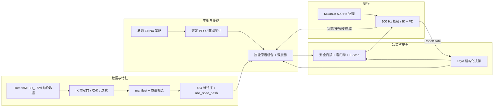
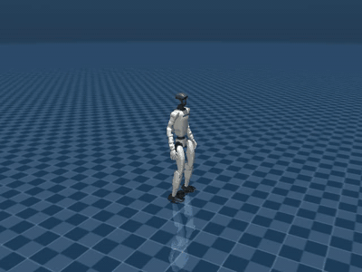
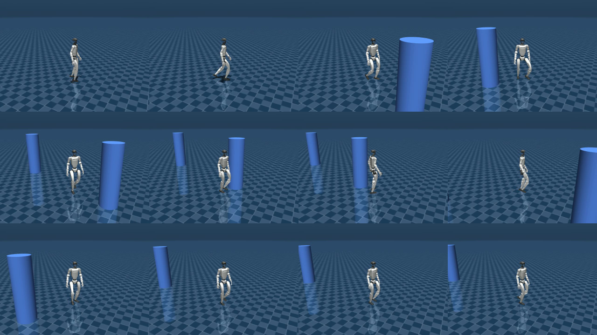
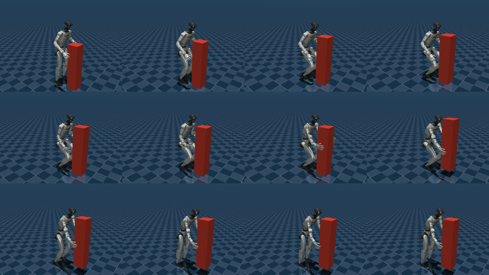

# G1 小脑平衡 + 多动作自适应组合系统

仓库：<https://github.com/DeRuiChen258/Unitree_Low-Level_Balance> · License: [MIT](LICENSE) ·
演示录像：[Releases · v1.0.0](https://github.com/DeRuiChen258/Unitree_Low-Level_Balance/releases/tag/v1.0.0) ·
Python 3.12 · PyTorch 2.14 (cu130) · MuJoCo 3.13 · Unitree G1（29 DOF）

> 基于 MuJoCo 的 Unitree G1 小脑平衡与多动作自适应系统：动作数据管线与 IK 重定向、教师 ONNX 复用加 PPO 残差、技能原语组合调度、LayA 结构化决策、安全门禁与 SDK2 预留。在此之上实现自主弯腰拾取：双手抱两侧、可搬运约半体重重物、绕柱避障，全程零穿模，并提供一键可视化演示与 MP4 录像

**一句话**：以小脑平衡策略为底座、技能原语为积木、LayA 结构化决策为路由的 G1 低层行为系统；
在此之上实现「行走 → 加速 → 急停 → 绕桩 → 停下抱起重物」的完整闭环，
全部在 MuJoCo 中可复现，并附带一键演示与录像。

---

## 目录

1. [项目定位与核心能力](#1-项目定位与核心能力)
2. [系统架构](#2-系统架构)
3. [仓库结构](#3-仓库结构)
4. [环境与依赖（CUDA / CPU 分工）](#4-环境与依赖cuda--cpu-分工)
5. [快速开始](#5-快速开始)
6. [全流程演示（含内嵌动图与逐段录像）](#6-全流程演示含内嵌动图与逐段录像)
7. [关键实测指标](#7-关键实测指标)
8. [拾取子系统详解](#8-拾取子系统详解)
9. [决策层与安全层](#9-决策层与安全层)
10. [测试与验收门禁](#10-测试与验收门禁)
11. [已知限制与披露](#11-已知限制与披露)
12. [Roadmap](#12-roadmap)
13. [许可与致谢](#13-许可与致谢)

---

## 1. 项目定位与核心能力

| # | 能力 | 实现 | 验证证据 |
| --- | --- | --- | --- |
| 1 | 平衡基座 | 复用官方教师 ONNX（跑步 2.0 m/s / 行走 AMP）+ 自研 PPO 残差（接口对齐 rsl_rl） | 教师 Sim2Sim 实测 1.98 m/s、无摔倒、峰值倾角 0.143 rad；ONNX 导出与 PyTorch 误差 2.4e-7 |
| 2 | 多动作组合 | 技能原语（stand / walk / run / jump / wave / turn / recover）+ 场景脚本 + 调度器 | 三场景 × 四扰动 × 10 seeds 组合评测，含最差 seed（转向 12.8°） |
| 3 | 结构化决策 | LayA 适配（`typed-decisions` ModernBERT-large + `multilingual` mmBERT-base）+ 四头 questions/映射 + 规则回退 | 决策数据集构建、校准与微调报告，服务化单条/批量接口 |
| 4 | 安全门禁 | SafetyWrapper（条件化）+ 看门狗 + E-Stop + 姿态/高度/速度/支撑域/关节限值检查 | 故障注入测试；`verify.py` 安全门禁含 NaN/高度/E-Stop 三项 |
| 5 | 弯腰拾取 | Balance Monitor → JEV-like 决策 → Motion Manager（FSM + 稳定门禁）→ 9 个行为原语 → 全身 IK + 关节 PD | 10/10 场景成功、0 摔倒、0 脚步、**全程零穿模** |
| 6 | 双手抱重物 | 双手分别压住箱体**左右两侧面**，载荷 = 机器人本体质量的 50% | 16.67 kg（本体 33.34 kg）搬运成功：6.87 s、零穿模、握持在侧面 70% 高度 |
| 7 | 绕柱避障 | 横向让位 + look-ahead 航向控制（世界系，不追航点）+ 逐柱通过判定 | 3 根柱子全部在预定侧绕过，最小间距 0.44 m，`pillar_passed_all=True` |
| 8 | 一键演示/录屏 | `start.sh` 串联 5 个场景，viewer 与 MP4 同录，ffmpeg 合并归档 | `recordings/` 6 个 MP4 + 2 张抽帧图；Release v1.0.0 附件 |

---

## 2. 系统架构



拾取子系统（`src/cb_pickup/`）独立成层，可脱离训练栈直接运行：

```
MuJoCo 状态 ──▶ Balance Monitor(COM/ZMP/CP/支撑域/裕度)
                     │
                     ▼
             JEV-like 决策(原语/置信度/风险/回退)
                     │
                     ▼
        Motion Manager(FSM + 稳定门禁 + 脚步规划)
                     │
                     ▼
   Stand/Bend/Step/Lunge/Reach/Grasp/Lift/StandUp/Recover
                     │
                     ▼
            全身 IK(多任务阻尼最小二乘) + 关节 PD
                     │
                     ▼
                MuJoCo 物理
```

**频率**：物理 500 Hz（`sim_dt=0.002`）· 控制 100 Hz · 平衡监测 100 Hz · 决策 20 Hz · 脚步规划 10 Hz；
JEV-like 与 LayA **不进入**硬实时回路。

---

## 3. 仓库结构

```
Low_Level_balance/
├── start.sh                     # 一键全流程演示（walk→加速→急停→绕桩→抱重物），默认 viewer + 录像
├── configs/                     # 系统/数据/技能/奖励/训练/服务/安全/LayA/拾取 配置
│   ├── g1_pickup.yaml           #   拾取系统：站姿、弯腰、抱取点、载荷质量比、gantry、判定阈值
│   ├── train_g1_balance.yaml    #   平衡训练与场景脚本（walk/walk_run/run_stop/pillar_slalom/...）
│   └── safety/limits.yaml       #   姿态/高度/速度/支撑域/关节限值门禁
├── src/
│   ├── cb_common/               # 配置、类型、日志、关节序转换（Isaac↔MuJoCo）
│   ├── cb_data/                 # 数据 ingest/分段/重定向/增强/过滤/manifest/质量报告
│   ├── cb_features/             # 434 维观测与文本化状态（训练/部署同一 obs_spec_hash）
│   ├── cb_train/                # PPO、残差、蒸馏、域随机化、ONNX 导出、MuJoCo 环境
│   ├── cb_skills/               # 技能原语：stand/walk/run/jump/wave/turn/recover
│   ├── cb_policy/               # 教师运行时、调度器、ONNX 策略封装
│   ├── cb_decision/             # LayA 适配、questions、映射、校准、微调
│   ├── cb_safety/               # SafetyWrapper、看门狗、E-Stop、限值判定
│   ├── cb_serving/              # FastAPI 服务（单条/批量/health/version）
│   ├── cb_robot/                # MuJoCo 适配层与真机接口预留（SDK2）
│   └── cb_pickup/               # 拾取子系统（见第 8 节）
├── scripts/                     # 数据/训练/导出/评测/决策/服务/演示/验收 CLI
│   ├── demo.py                  #   平衡系统 demo（run_wave / run_jump / turn_wave）
│   ├── demo_balance_extra.py    #   压力场景（walk/walk_run/run_stop/pillar_avoid/pillar_slalom/carry_box）
│   ├── run_pickup.py            #   弯腰拾取一条命令跑通（viewer/video/–record）
│   └── verify.py                #   16 项验收门禁（--all）
├── tests/                       # pytest（数据/特征/训练/技能/决策/安全/服务/机器人/拾取）
├── docs/design/                 # 设计文档（架构、特征、技能、决策、安全、服务、sim2real、拾取…）
├── Prompt/                      # 需求提示词与参考资料（含 2 篇数据增强参考论文）
├── recordings/                  # 演示动图/抽帧图（MP4 见 Release，可一键重建）
├── .agent/                      # 实现台账（state/decisions/memory/failures）
└── TASK.md                      # 任务书与 Checklist（逐项勾选）
```

---

## 4. 环境与依赖（CUDA / CPU 分工）

| 组件 | 版本 / 说明 |
| --- | --- |
| OS / GPU | Ubuntu（Wayland），NVIDIA RTX 5070 Laptop 8 GB，驱动 615.71.09 |
| Python | 3.12.9（conda env `unitree_rt`） |
| PyTorch | 2.14.0+cu130，`torch.cuda.is_available() == True` |
| MuJoCo | 3.13.0（含 `mujoco.viewer`、`mj_geomDistance`） |
| ONNX Runtime | 1.30.0（教师策略 CPU 推理） |
| 机器人模型 | `mujoco_menagerie/unitree_g1`（position 执行器）与 `G1_run/deploy/.../scene_29dof.xml`（motor + PD） |
- **计算策略**：MuJoCo 步进、IK、数据管线、并行采样走 **CPU**；策略训练、LayA 推理、小批量服务走 **GPU**，
  显式限制并发以避免 8 GB 显存与 CPU 争抢（详见 `configs/system.yaml`）。
- **降级说明**：IsaacLab / rsl_rl 本机不可用，训练栈降级为 **MuJoCo + 自研 PPO**，接口与 rsl_rl 对齐。

---

## 5. 快速开始

```bash
conda activate unitree_rt
pip install -e ".[dev,export,laya]"

# 0 环境自检
python -c "import sys,torch,mujoco; print(sys.version.split()[0], torch.__version__, torch.cuda.is_available(), mujoco.__version__)"

# 1 数据管线（smoke profile；full 见 configs/data.yaml）
python scripts/data_build.py --profile smoke
python scripts/data_quality.py --run runs/data_quality/<version>

# 2 训练 + 导出（教师复用 + 残差/蒸馏）
python scripts/train.py --config configs/train_g1_balance.yaml
python scripts/export_onnx.py --run runs/exp/<name>

# 3 评测（组合场景 × 扰动 × seeds）
python scripts/eval.py --run runs/exp/<name> --seeds 10

# 4 服务与安全
python scripts/serve.py --config configs/serving.yaml
pytest -q tests/test_safety_*.py

# 5 验收（16 项门禁）
python scripts/verify.py --all
pytest -q && ruff check src scripts tests
```

---

## 6. 全流程演示（含内嵌动图与逐段录像）

`start.sh` 依次演示：**行走 → 加速跑步 → 急停 → 绕多个柱子 → 停下来抱重物**，
覆盖平衡系统（教师策略 + 技能 + 安全层 + 平衡指标）与拾取系统（双手抱两侧 + 半体重载荷）。

### 6.1 完整演示（正文内联播放）

下面的动图由 `recordings/demo_full.mp4` 转制（3× 加速、400×300、6.8 MB），
对应上面 5 个场景的**完整无剪辑流程**：



> GitHub 会过滤 README 中的 `<video>` 标签（已实测：raw 文件保留、渲染 HTML 无 `<video>`），
> 因此正文用动图内联播放；**原始 2 分钟 MP4**（30 MB，含音轨无关的完整帧率）见
> [Release v1.0.0 / demo_full.mp4](https://github.com/DeRuiChen258/Unitree_Low-Level_Balance/releases/download/v1.0.0/demo_full.mp4)。

### 6.2 逐段录像明细（Release v1.0.0 附件）

1 seed 实测，全部**无安全拦截、无摔倒**：

| 录像 | 场景与命令 | 实测指标 | 关注点 |
| --- | --- | --- | --- |
| [1_walk.mp4](https://github.com/DeRuiChen258/Unitree_Low-Level_Balance/releases/download/v1.0.0/1_walk.mp4) | `--scenario walk`，0.8 m/s，8 s | roll 1.99° / pitch 2.38°，裕度最小 −0.017 | 稳态行走姿态与支撑域裕度 |
| [2_walk_run.mp4](https://github.com/DeRuiChen258/Unitree_Low-Level_Balance/releases/download/v1.0.0/2_walk_run.mp4) | `walk_run`，0.6 → 2.0 m/s | roll 4.07° / pitch 3.25°，裕度最小 −0.058 | 提速过程中教师策略与残差接管 |
| [3_run_stop.mp4](https://github.com/DeRuiChen258/Unitree_Low-Level_Balance/releases/download/v1.0.0/3_run_stop.mp4) | `run_stop`，2.0 m/s → 停止 | roll 5.37° / pitch 7.14°，**急停距离 1.49 m** | 急停姿态冲击与制动距离 |
| [4_pillar_slalom.mp4](https://github.com/DeRuiChen258/Unitree_Low-Level_Balance/releases/download/v1.0.0/4_pillar_slalom.mp4) | `pillar_slalom`，3 根柱、左右交替 | 柱1 +0.96 / **柱2 +0.51** / 柱3 +1.42（阈值 0.45 m），最小间距 0.44 m | 逐柱通过判定 `pillar_passed_all=True` |
| [5_pickup_heavy.mp4](https://github.com/DeRuiChen258/Unitree_Low-Level_Balance/releases/download/v1.0.0/5_pickup_heavy.mp4) | `run_pickup --scenario front` | **16.67 kg（≈本体 50%）**，成功 6.87 s、0 脚步、零穿模（间隙 +0.025 m） | 双手抱两侧、掌面平贴、握持在侧面 70% 高度 |
| [demo_full.mp4](https://github.com/DeRuiChen258/Unitree_Low-Level_Balance/releases/download/v1.0.0/demo_full.mp4) | 上述 5 段 ffmpeg 合并（≈2 min，30 MB） | — | 整体节奏与连贯性 |

### 6.3 抽帧核验图

绕桩全过程（每根柱子都在**预定侧**绕过；第 2 根已从"贴柱擦过"修正为右侧通过）：



抱取重物全过程（握持点在箱体侧面约 70% 高度，双掌与箱面平齐）：



### 6.4 命令与录制参数

```bash
./start.sh                        # 依次弹出 5 个 MuJoCo 窗口，并同步录像
RENDER=video ./start.sh           # 无窗口，直接出 5 段 MP4
RENDER=none  ./start.sh           # 只跑指标（最快，约 13 s）
RENDER=none RECORD=1 ./start.sh   # 无窗口但仍录制 MP4（最快出片，约 2 min）
STEPS=600 SEED=2 CARRY_MASS=16.67 PILLARS="4.5,0.45;8.0,-0.45;11.5,0.45" ./start.sh
```

演示结束后录像自动归档到 `recordings/`（`1_walk.mp4` … `5_pickup_heavy.mp4`），
并用 ffmpeg 合并为 `demo_full.mp4`；抽帧图见 `frame_sheet_slalom.png`、`frame_sheet_pickup.png`。

单场景入口：

```bash
python scripts/demo_balance_extra.py --scenario walk|walk_run|run_stop|pillar_avoid|pillar_slalom|carry_box \
    --render viewer --pillars "4.5,0.45;8.0,-0.45;11.5,0.45" --carry-mass 8
python scripts/run_pickup.py --scenario front --baseline C --render viewer --record
```

> 注：本机 Wayland/EGL 下 MuJoCo 交互窗口在**进程退出阶段**可能 segfault（发生在结果与录像落盘之后），
> `start.sh` 已容错并提示；需要完全无崩溃输出时用 `RENDER=video`。详见 `.agent/failures.md`。

---

## 7. 关键实测指标

### 7.1 平衡与技能组合

| 场景 | 指令 | roll 峰值 | pitch 峰值 | 支撑裕度最小 | 备注 |
| --- | --- | --- | --- | --- | --- |
| `walk` | 0.8 m/s 8 s | 1.99° | 2.38° | −0.017 | 稳态行走 |
| `walk_run` | 0.6 → 2.0 m/s | 4.07° | 3.25° | −0.058 | 加速切换 |
| `run_stop` | 2.0 m/s → 停 | 5.37° | 7.14° | −0.090 | **急停距离 1.49 m** |
| `pillar_slalom` | 3 柱绕行 | 3.26° | 3.66° | −0.023 | 三柱预定侧通过，最小间距 0.44 m |
| `run_wave` | 2 m/s + 挥手 | 4.06° | 2.37° | −0.011 | 速度保持 0.50、挥手误差 0.064 |
| `run_jump` | 跑 + 跳 | — | — | — | 跳高 0.786 m、离地间隙 0.088 m |
| `turn_wave` | 转身 45° + 挥手 | — | — | — | 转角误差 5.2e-5 rad、挥手误差 0.099 |

### 7.2 弯腰拾取（10 场景 × 1 seed）

| 场景 | 成功 | 摔倒 | 脚步 | 最小箱体间隙 |
| --- | --- | --- | --- | --- |
| front / push / low_friction / random / moving / post_grasp_push | ✅ | 0 | 0 | +0.025 ~ +0.026 m |
| left / right | ✅ | 0 | 0 | +0.010 / +0.014 m |
| deep / far | ✅ | 0 | 0 | +0.007 / +0.049 m |

front 场景时间线：弯腰 2.2 s → 伸手 1.8 s → 双手抱取 0.5 s → 抬升 → 起身，总 **6.87 s**；
载荷 16.67 kg，握持点在箱体侧面 **70%** 高度，掌面与箱面偏差 ≤0.9°，腕 roll ±0.03 rad。

### 7.3 4-baseline 对照（拾取系统，论文式表格）

| Baseline | 拾取成功率 | 摔倒率 | 平均脚步 | 平均裕度 |
| --- | --- | --- | --- | --- |
| A 固定脚 | 0.00 | 0.00 | 0.0 | −0.136 |
| B 固定阈值脚步 | 0.00 | 0.00 | 3.0 | — |
| C 平衡感知（本工程默认） | 1.00 | 0.00 | 0~1 | +0.053 |
| D JEV-like 决策层 | 1.00 | 0.00 | 1.0 | +0.053 |

产物：`experiments/evaluation/{evaluation.json,csv,md}`、`experiments/ablation/{ablation.json,md}`。

---

## 8. 拾取子系统详解

### 8.1 行为原语与状态机

| 原语 | 作用 | 关键实现 |
| --- | --- | --- |
| `STAND` / `BEND` | 站立 / 弯腰 | 先躯干前倾（0–55%），再屈膝下沉（25–100%）；骨盆后坐保持质心在支撑域 |
| `REACH` | 双手接近箱体两侧 | 两段路径（先外移对齐 → 再沿侧面推向触点）+ 衰减小幅摆动 |
| `GRASP` | 抱取锁存 | 双手各自到位（阈值 0.12 m）才允许锁存；恢复态禁止新抓取 |
| `LIFT` / `STAND_UP` | 抬升 / 起身 | 抱持时双手随基座平移；起身把骨盆升回站立高度（不是只回正躯干） |
| `STEP` / `LUNGE` | 调步 / 弓步 | Capture Point + 预测裕度触发；去抖 3 个决策周期 |
| `RECOVER` | 恢复 | 降低前倾、必要时迈步；负重时以 carry 阈值判定，避免与 gantry 冲突 |

### 8.2 全身 IK 与 PD

- 多任务阻尼最小二乘： pelvis(CoM xy) + 双足位置/朝向 + 躯干朝向 + 双手腕位置/朝向；
- **姿态正则**（零空间偏好）：按基座下沉深度给出"微屈膝"参考，消除直腿奇异导致的
  双脚被地面反推外滑（岔腿）；
- **自穿模线搜索**：按穿透深度而非接触计数拒绝解，避免 IK 在穿模构型上被"冻结"；
- **腕部姿态任务**：掌心法向 / 手指方向由手板几何标定（左右手共用同一法向约定），
  使掌面与箱体侧面平齐——`wrist_roll` 从 ±0.93 rad 降到 ±0.03 rad。

### 8.3 载荷与抓取模型（Phase-1）

- 箱体质量 = 机器人本体质量 × `object_mass_ratio`（默认 0.5 → 16.67 kg）；
- 载荷以**等效重力旋**施加在躯干（力 + 力臂力矩），随"收拢贴身"过程 0→1 渐增加载；
- 箱体碰撞关闭（避免运动学负载与接触求解互相冲突），改为逐帧
  `mj_geomDistance` 计算**最小几何间隙**作为"零穿模"硬指标；
- mock grasp 为运动学抱持（不模拟接触力/惯量），可在真机路线中替换为接触抓取与 WBC。

### 8.4 判定与门禁

| 判定 | 规则 |
| --- | --- |
| 抱取锁存 | 双手各自与目标触点距离 ≤ `grasp_distance`(0.12 m)，且当前处于 GRASPING 阶段 |
| 零穿模 | 全程箱体-机器人最小间隙 > 0（回归测试断言 10/10 场景通过） |
| 负重失稳 | 负重阶段使用 `carry_critical_margin_m=-0.25`（Phase-1 有 gantry，CoM 判据不适用），真实裕度逐帧如实上报 |
| 绕桩通过 | 机身前缘越过柱心时横向让位 ≥ 柱半径 + 机身半宽（0.45 m）且位于预定侧；缺记录视为未通过 |
| 任务成功 | 抱起并回到直立站姿（骨盆高度回到站立值附近、躯干回正、无摔倒） |

---

## 9. 决策层与安全层

- **LayA 结构化决策**：`typed-decisions`（ModernBERT-large，1024 ctx，842 MB）与
  `multilingual`（mmBERT-base，643 MB）双后端；输出 action/confidence/risk/fallback，
  MLP checkpoint 缺失时按设计回退规则——**不进入硬实时回路**（P99 323 ms，目标 150 ms，未达标，见第 11 节）。
- **安全层**：`SafetyWrapper` 串联 E-Stop → 看门狗 → 指令条件化 → 限值判定；
  门禁维度包含关节位置/速度/力矩、基座姿态与高度、垂直速度、支撑域裕度、NaN；
  真机侧预留 SDK2 通道与急停通道（Gate 0–2：编译级 / 启动级 / 接口级 / dry-run）。

---

## 10. 测试与验收门禁

```bash
pytest -q                        # 全部单测/集成测试（数据/特征/训练/技能/决策/安全/服务/机器人/拾取）
ruff check src scripts tests     # 静态检查
python scripts/verify.py --all   # 16 项验收门禁 → OVERALL PASS
```

`verify.py` 覆盖：环境自检、数据 manifest、特征 obs_spec_hash、ONNX 一致性、组合评测、
决策报告、服务健康、安全门禁、文档完整性、台账文件、拾取 Demo/baseline/ablation/docs/tests、可视化产物。

---

## 11. 已知限制与披露

1. **仅仿真，无真机**：所有结论止于 MuJoCo + SDK2 dry-run；真机路线与门禁见 `docs/design/sim2real.md`。
2. **Phase-1 虚拟基座辅助（gantry）**：拾取阶段用骨盆弹簧-阻尼稳定基座，
   以隔离脚滑/执行器饱和等混杂因素；半体重载荷下真实稳定裕度为 **−0.160 m**（由 gantry 承担倾覆力矩），
   指标逐帧如实上报，完整 WBC/RL 为后续替换项。
3. **等效力旋载荷模型**：箱体为运动学抱持 + 等效重力旋，不模拟接触力与惯量一致性。
4. **手臂可达下探约 0.56–0.60 m**：地面箱体的握持点必然偏上；本工程把箱体改为
   0.20×0.20×0.90 m 使握持点落在侧面 ~70% 高度；需要更低握持可用 `object_base_height_m` 加台面。
5. **负结果**：PPO 残差组合评测 16/18 摔倒、蒸馏学生绝对模式 18/18 摔倒（需 DAgger）；
   默认控制器保持"教师 + 技能 + 安全层"，负结果记录于 `.agent/failures.md` 与消融报告。
6. **LayA 延迟**：P99 323 ms > 150 ms 目标，当前只做离线/低频结构化决策。
7. **环境问题**：Wayland/EGL 下 MuJoCo 交互窗口在退出阶段可能 segfault（结果与录像已落盘），
   非仿真本身缺陷；`start.sh` 已容错。
8. **数据缺口**：AMASS 为空、KIT-ML 为 `.rar`、HumanML3D(263d) 仅解出 1 个样本，
   均未伪装成已用数据；现有管线基于 HumanML3D_272d（26846 段，smoke 308 段入库）。

---

## 12. Roadmap

- [ ] 用 WBC/QP 或 RL 平衡控制器替换 gantry，实现无辅助的半体重搬运与主动迈步配平
- [ ] 接触式抓取 + 惯量一致的载荷建模（替换等效重力旋）
- [ ] 远距离弓步（>0.56 m）在完整 WBC 下的稳定实现
- [ ] LayA 蒸馏/量化把 P99 压到 150 ms 内，并进入低频决策回路
- [ ] IsaacLab / rsl_rl 训练栈接入（本机不支持时的等价复现实验）
- [ ] 真机 Gate 3+：SDK2 实机 dry-run → 低增益首测 → 负载分级验证

---

## 13. 许可与致谢

- License：[MIT](LICENSE)（Copyright © 2026 CDR）。
- 教师策略与部分模型资产来自 Unitree 官方动作工程（`G1_run` / `G1_Walk` / `G1_Waving`）与
  MuJoCo Menagerie 的 G1 模型；动作数据来自 HumanML3D_272d 表示。
- 需求与设计提示词见 `Prompt/`，实现台账见 `TASK.md` 与 `.agent/`。
