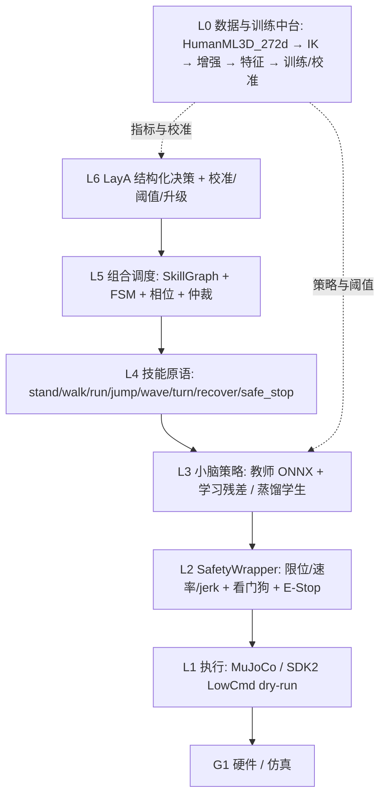

# 系统架构（第 3 节）

## 1. 分层

每一层只通过消息接口通信：`RobotState`、`SkillCommand`、`SkillOutput`、`JointCommand`、
`DecisionOutput`、`SafetyDecision`。跨层不走隐式全局状态。

## 2. 端到端数据流

```mermaid
graph LR
    A[HumanML3D_272d 272d@30FPS] --> B[规范化/根对齐/相位]
    B --> C[MuJoCo DLS IK → G1 29DOF]
    C --> D[切片/镜像/时间/幅度/过渡增强]
    D --> E[物理过滤 + manifest]
    E --> F[特征: proprio/balance/phase/skill]
    F --> G[MuJoCo + 教师 ONNX + PPO 残差 / 蒸馏学生]
    G --> H[技能组合场景评测]
    H --> I[LayA 决策: 原语/风险/回退/人工]
    I --> J[SafetyWrapper + watchdog + E-Stop]
    J --> K[Gate 0–2: 单测/仿真/SDK2 dry-run]
```

## 3. 时序边界（硬性）

| 回路 | 频率 | 责任 |
| --- | --- | --- |
| 物理仿真 | 200 Hz（`sim_dt=0.005`） | MuJoCo |
| 小脑控制 | 50 Hz（`control_dt=0.02`，decimation=4） | 教师/学生 + 技能叠加 + 安全层 |
| 安全监控 | ≥50 Hz + 事件驱动 | SafetyWrapper / watchdog（0.2/0.2/0.05 s） |
| 组合调度 | 10–50 Hz | FSM / PhaseClock / Arbiter |
| LayA 决策 | 1–20 Hz（实测见 `runs/decision`） | 结构化决策，不进硬实时 |
| 人工接管 | 事件驱动 | veto / need_human_review / 连续失败 |

## 4. 实测边界

- 教师 `g1_run.onnx`：8 s、cmd 2.0 m/s → 平均 1.98 m/s、无摔倒、peak tilt 0.143 rad。
- 组合基线（3 场景 × 4 扰动 × 3 seeds）：0 摔倒；详细数字见 `runs/reports/*/eval.md`。
- 本机无真机，全部硬件结论止于 Gate 2（编译级/启动级/接口级/dry-run）。
