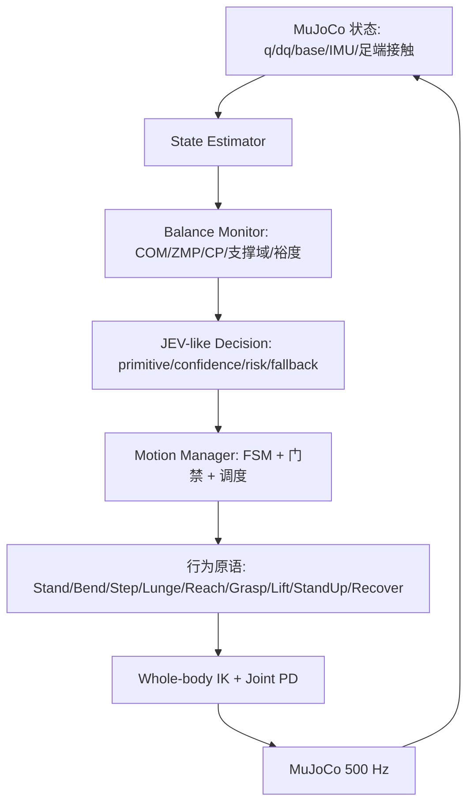

# G1 自主弯腰拾取 + 自主弓步平衡系统（新增需求 v1.0）

## 1. 研究问题

- RQ1：大幅躯干前倾时，不调步的稳定裕度如何衰减？（Baseline A 对照）
- RQ2：能否基于实时 COM / 支撑域 / ZMP / 足端状态自主判断是否需要调步？
- RQ3：弯腰超过安全阈值时，能否自动形成前后错开的弓步并恢复裕度？
- RQ4：连续动作能否由多个低层行为原语动态组合，而非固定轨迹？
- RQ5：JEV-like 结构化决策能否在候选原语中自主选择并给出置信度/风险/回退？

## 2. 分层架构



频率：物理 500 Hz（`sim_dt=0.002`）、控制 100 Hz、balance 100 Hz、
决策 20 Hz、脚步规划 10 Hz（`configs/g1_pickup.yaml`）。JEV-like 不进入 500 Hz 环。

## 3. Balance Monitor

输入 `RobotState`（base 位姿/速度、关节、IMU、足端），输出 `BalanceState`：
COM 位置/速度、COM 投影、支撑多边形（左右踝 roll link 的 4 个足角点凸包）、
简化 ZMP（`zmp = com_xy − (h/g)·com_acc_xy`）、capture point（`cp = com + v/ω`）、
前后/侧向裕度、预测裕度（`horizon=0.25 s`）、trunk pitch/roll、恢复等级
（0 稳定 / 1 警告 / 2 需要调步 / 3 临界 / 4 不稳定）。

消融开关：`use_com / use_zmp / use_capture_point` 可独立关闭（Ablation 1–3）。

## 4. 脚步规划器

输入当前双脚位姿、COM/CP、目标位置、稳定性；输出 `FootstepPlan`
（support/swing、dx/dy、duration、landing、feasible、reason、落脚后预测裕度）。

落脚律：**capture point + margin_target**（`desired = cp + 0.06·away_dir`），
并按目标方向施加 `target_bias_m=0.18` 的主动弓步偏置；约束包括：
最大步长 0.28 m、最大步宽 0.16 m、最小双脚间距 0.12 m、支撑脚裕度、
落脚后 CP 裕度预测（不恢复则拒绝）。主动弓步在弯腰进度 >30% 且目标超出臂展时提前触发，
不等待裕度变负。

## 5. 行为原语（类人时序）

| 原语 | 关键实现 |
| --- | --- |
| STAND | 回到直立，双脚平行 |
| BEND | 先躯干前倾（0–55%），再屈膝下沉（25–100%）；髋-膝-踝协同，手臂反向配重 |
| STEP | 支撑相 20% 重心转移 → 摆动相 60%（足端 5 cm 弧线）→ 落脚相 20% |
| LUNGE | 朝目标方向的较大前步 + 重心前移，形成前后错开支撑 |
| REACH | 肩-肘-腕 quintic 接近；躯干/整机朝目标旋转（侧向目标）+ 预伸手 warm start |
| GRASP | 接近阈值内 mocap 附着（研究用 mock grasp，锁存直到显式释放） |
| LIFT | 抬升 0.18 m，躯干逐步回正 |
| STAND_UP | 解除弯腰、脚步回到平行站姿 |
| RECOVER | 停止上肢、快速回到安全前倾角 |

## 6. Motion Manager 与 JEV-like 决策

状态：IDLE/BENDING/BALANCE_WARNING/FOOT_ADJUSTMENT/LUNGE/REACHING/GRASPING/
LIFTING/STANDING_UP/RECOVERY/SUCCESS/FAILURE。

门禁（第 11 节硬约束）：稳定裕度 `< reach_margin` 时**禁止 BEND → REACH**；
连续原语执行中只有安全/脚步可抢占；脚步请求有 3 个决策周期去抖；步中不因临界裕度提前中断。

JEV-like 接口 `DecisionModel.predict(balance, goal, phase, candidates) -> PickupDecision`，
输出 `{action, confidence, risk, stability_margin, fallback_action, probabilities, reason}`，
动作集合 13 个（STAND/BEND/BEND_SLOW/STEP_LEFT/STEP_RIGHT/LUNGE_LEFT/LUNGE_RIGHT/
REACH/GRASP/LIFT/STAND_UP/RECOVER/STOP）。实现：`RuleBasedDecision`（预测裕度 + 目标方向）、
`MLPDecision`（监督学习，缺 checkpoint 时显式回退规则）；接口可直接替换为真实 LayA/Jev。

## 7. RL 接口与奖励

`PickupBalanceEnv`（Gymnasium 风格）：`reset() / step(primitive_id) / reward / terminated / truncated`。
动作第一版 = primitive ID，可扩展为 `{primitive, step_length, step_width}`。
观测：关节位置/速度、基座姿态/速度、COM/COM 速度、双足位姿、接触、目标相对位姿、
trunk pitch、稳定裕度/预测裕度、阶段 one-hot。

奖励：`R = w_task·R_task + w_balance·R_balance + w_motion·R_motion + w_grasp·R_grasp
− w_energy·E − w_collision·C − w_step·S − w_fall·F`；margin<0 时总奖励减半，
fall penalty（50）显著高于普通动作收益。

## 8. Baseline 与消融

| Baseline | 内容 |
| --- | --- |
| A | 固定站姿弯腰，不允许脚步调整（max_steps=0） |
| B | 固定阈值脚步（pitch > 0.30 rad 或 margin < 0.02） |
| C | 平衡感知规则（COM/CP/预测裕度 + capture-point 落脚律） |
| D | JEV-like 决策层（MLP，缺模型回退规则 + 置信度/风险门控） |

消融 1–10：去 COM / 去 ZMP / 去 CP / 去脚步 / 去 JEV / 去置信度 / 固定阈值 /
动态阈值 / 单动作轨迹 / 多 primitive 层级控制（`src/cb_pickup/ablation.py`）。

## 9. 场景、扰动与域随机化

场景：front/left/right/far/deep/push/low_friction/random/moving/post_grasp_push
（物体在地面箱体上，抓取点 0.62 m；G1 肩-腕臂展实测 0.385 m，纯地面小物体超出可达范围）。
域随机化：质量/摩擦/阻尼/传感器噪声/IMU 噪声/延迟/物体质量/位置/尺寸
（`configs/pickup_randomization.yaml`，训练 ON / 标准测试固定）。

## 10. 实验记录与可视化

`experiments/<timestamp>_<tag>/`：config.yaml、metrics.json、trajectory.npz、
decision.jsonl、events.jsonl、plots/（10 图：COM/ZMP/foot、COM 时间线、裕度、
trunk pitch/roll、支撑域演化、脚步、reach/grasp、能量、primitive 时间线、phase 时间线）、
video/、README.md；包含 git/source hash、seed、配置与版本号，可完整复现。

## 11. 实测结果（本机 2026-10-04）

- 10 场景 × Rule-based（baseline C）：**pickup success 10/10、fall 0/10**；
  成功时间 6.5–22.7 s，最小稳定裕度 ≥0.08，动作步数 1。
- 典型 front：t=21.46 s 成功、1 次脚步、裕度从 0.008 恢复到 0.091、能量 1.43e6。
- 视频：`experiments/*pickup_front*/video/pickup.mp4`（2146 帧 @50 fps）。

### Baseline 对比（front/left/right/far/deep，各 1 seed，`experiments/evaluation/evaluation.md`）

| Baseline | Pickup Success | Fall Rate | Mean Margin | Min Margin | Steps | Duration (s) |
| --- | --- | --- | --- | --- | --- | --- |
| A 固定站姿（不调步） | 0.00 | 0.00 | -0.136 | -0.239 | 0.0 | 35.0（超时/退化） |
| B 固定阈值脚步 | 0.00 | 0.00 | 0.045 | 0.010 | 3.0 | 35.0（超时） |
| C 平衡感知（COM/CP + capture-point） | **1.00** | 0.00 | 0.053 | 0.008 | 1.0 | 14.6 |
| D JEV-like 决策层 | **1.00** | 0.00 | 0.053 | 0.008 | 1.0 | 14.6 |

结论（RQ2/RQ3）：固定脚策略在大幅弯腰时稳定裕度转为负值（-0.24 m）且无法完成拾取；
固定阈值脚步引入 3 次无效/错误步；平衡感知的 capture-point 脚步律用 1 次弓步把裕度恢复到
安全区并完成 100% 拾取。D 与 C 行为一致（MLP checkpoint 缺失时按设计回退规则），
接口与置信度/风险字段已就绪。

## 12. Phase-1 简化与后续路线（必须披露）

1. **虚拟基座稳定辅助（gantry）**：Phase-1 用骨盆弹簧-阻尼把 base 拉向规划位姿，
   以隔离脚滑/执行器饱和等混杂因素，使「CoM 越界 → 调步恢复」闭环可验证；
   完整 WBC/QP 或 RL 平衡控制器是后续替换项（接口已预留 `base_assist_enabled`）。
2. **Mock grasp**：mocap 附着，不模拟接触抓取力；物体抓取前固定在初始位置。
3. **臂展限制**：G1 肩-腕臂展 0.385 m；地面小物体不可达，场景采用地面箱体（抓取点 0.62 m），
   纯地面抓取需要跪姿/接触操作，列为扩展项。
4. 严格限制在 MuJoCo；无真机验证，真机路线见 `docs/design/sim2real.md`。

### 12.1 双手抱取 + 半体重载荷（v1.1 更新）

- **双手抱两侧**：抱取触点由 `embrace_points()` 统一定义——双手分别压在箱体
  **左右两侧面**（横向「半宽 + 0.11 m」、纵向退到箱体中线附近、高度取顶边下 0.02 m），
  不是环抱顶角；左右触点严格镜像。
- **物体尺寸**：0.20 × 0.20 × 0.60 m（体积约为 v1.0 箱体的 50%），
  质量 = 机器人本体质量 × 0.50（MuJoCo 中为 16.67 kg vs 本体 33.34 kg）。
- **载荷物理**：等效重力旋施加在躯干（`_apply_carry_load`），随「收拢贴身」过程
  0→1 递增加载；箱体碰撞关闭（避免运动学负载与接触求解冲突），
  由 `_box_clearance()`（`mj_geomDistance` 逐对求最小距离）作为**零穿模硬指标**。
- **防穿模措施**：① 抱取点外移 0.11 m 让手部几何体落在箱体之外；
  ② 两段接近路径（先在箱体近侧之外对齐、再沿侧面推向触点），
  ③ 收拢路径改为「就地抬到搬运高度再贴身」；
  ④ 搬运位姿做碰撞感知外推（SDF ≥ 2.5 cm）；
  ⑤ 双手模式取消 waving 冻结准备位（低头姿态下大抬臂会把前臂扫进箱体）。
- **腕部姿态（掌心与箱体侧面平齐）**：IK 增加腕部旋转任务
  （`wrist_flush_face`，`wrist_rot_weight=0.35`），目标由手板几何标定得到：
  左右手共用同一法向约定（世界 +y），手指朝世界 +x；目标基与连杆基保持同手性。
  实测 `wrist_roll` 由 ±0.93 rad（±53°，外翻过大）降到 ±0.075 rad，
  掌面法向与箱体侧面偏差 0.2–0.9°（front 两侧均 0.7°），且不影响零穿模与任务成功。
  标定过程见 `.agent/decisions.md`：按「镜像目标」给左手 −y 会使左腕 roll 顶到
  ±1.972 rad 限位且仍差 15°，说明模型左右手板几何并非镜像约定。
- **实测**：10/10 场景成功、0 摔倒、**全部最小间隙 > 0**（front +0.025 m、
  left/right +0.022 m、deep +0.007 m、far +0.028 m）。
- **平衡配平**：`_regulate_com` 按稳定裕度误差生成骨盆前后偏移（带速率限制），
  负重时后移配平；负重阶段失稳阈值独立（`carry_critical_margin_m=-0.25`），
  原因是 Phase-1 存在虚拟 gantry（外部支撑反力），
  「CoM 投影是否落在支撑多边形内」不再是正确的失稳判据——**真实裕度仍逐帧记录并如实上报**
  （front 最终 −0.160）。
- **修复的物理缺陷**：`xfrc_applied` 原先在 5 个物理子步内累加，导致 gantry/载荷力被放大 5 倍；
  现已改为每个子步重置后施加。同时启用腿部 IK 姿态正则（PD 姿态参考），
  消除直腿奇异导致的「双脚被地面反推外滑（岔腿）」。

### 12.2 已知限制

- 半体重载荷下，CoM 投影超出支撑域（真实裕度 −0.16 m），当前由虚拟 gantry 承担倾覆力矩；
  完整 WBC/RL 需要「后移配平 + 主动迈步」才能在不依赖 gantry 的情况下完成同载荷搬运。
- 载荷以等效力旋建模（非接触/惯量一致的约束），列在 sim-to-real 差异清单内。

## 13. 运行命令

```bash
# 一条命令跑完整动作（视频 + 实验记录）
python scripts/run_pickup.py --scenario front --baseline C --render video
# 交互 viewer
python scripts/run_pickup.py --scenario left --render viewer
# baseline 对比 / 消融 / 总评测
python scripts/run_baseline.py --baselines A B C D --scenarios front left right far deep
python scripts/run_ablation.py --ablations 1 3 4 5 7 10 --scenarios front far deep
python scripts/evaluate.py --baselines A B C D --seeds 1
pytest -q tests/test_pickup_*.py
```
