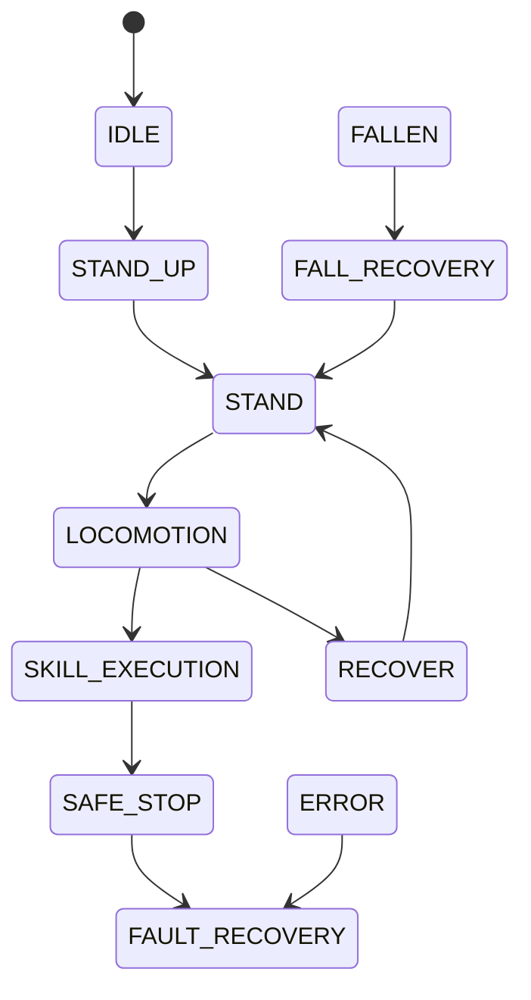

# 安全层（第 10 节）

## 1. 分层

L1 硬件急停/限位/供电 → L2 DDS/网卡/domain + watchdog → L3 关节限位/速度/加速度/jerk/
力矩 → L4 状态机锁存/人工复位 → L5 MuJoCo 仿真门禁 → L6 运维手册/首测清单。

## 2. 命令条件器

位置 → 速度 → 加速度 → jerk 顺序限幅，并做可行制动校验（速度上界由剩余距离与
减速度反推）。所有阈值来自 `configs/safety/limits.yaml`；文件缺失或字段非法时
`load_safety_limits` 抛 `SafetyError`，系统拒绝运动（fail-closed）。

## 3. 状态机

非法迁移拒绝并抛错；SAFE_STOP/ERROR 锁存，只能 `manual_reset` 且必须带操作人。

## 4. 看门狗与 E-Stop

状态 0.2 s / 命令 0.2 s / 控制回路 0.05 s；超时 WARN → ABORT → EMERGENCY。
E-Stop 独立通道，锁存 + 人工复位，不依赖主控制循环与决策服务。
决策服务不可用：保持当前技能 → 安全则降级 stand → 有风险则 safe_stop。

## 5. 故障注入

`tests/test_safety_*.py` 覆盖 NaN、越界、断连（watchdog）、急停、锁存复位；
`scripts/verify.py` 额外注入低高度/NaN/E-Stop 三条路径并要求全部被拒绝。

## 6. 无真机边界

全部硬件结论止于 Gate 2；`SDK2Adapter(allow_send=True)` 直接拒绝构造。
真机首测按 `docs/sim2real.md` 执行。

## 7. 速度阈值来源与偏差

部署 YAML（`g1_amp.yaml`）不提供关节速度上限；`configs/safety/limits.yaml` 中的
速度额定值（腿/臂 20 rad/s、踝/腕 15 rad/s）与角速度阈值（150/250/400 deg/s）
是**工程估算 + 动态技能实测**（跑跳落地峰值 196 deg/s）的结果，用于仿真门禁。
真机首次站立测试必须按官方 datasheet / SDK2 实测重新核定，并采用更保守的静态阈值。
测量状态允许 1e-2 rad 的数值越界容差；命令目标仍按 `position_margin_rad` 严格检查。
